# windows挂载linux共享目录（Ubuntu）

---

## 1. 安装Samba

```shell
sudo apt-get install samba
```

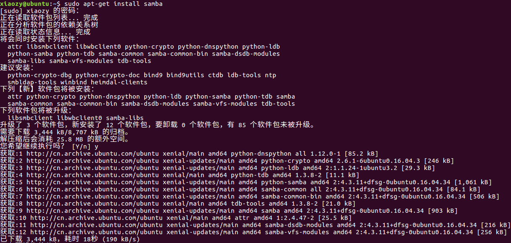

## 2. 查看Samba版本，验证安装结果

```shell
samba
```

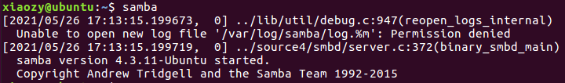

## 3.修改Samba配置文件

### 3.1 备份

```shell
sudo cp /etc/samba/smb.conf  /etc/samba/smb.conf.bak
```

```shell
ls /etc/samba/
```

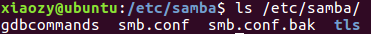

### 3.2 修改配置文件

```shell
sudo vi /etc/samba/smb.conf
```

在配置文件尾部添加下列配置信息，然后退出：

```shell
[samba]
   comment = samba home direction
   path = /usr/samba
   browseable = yes
   writeable = yes
   available = yes
   valid users = xiaozy
   write list = xiaozy
   directory mask = 0775
   create mask = 0775
```

参数说明：

```
# 共享资源名称
[samba]
   # 共享资源说明
   comment = samba home direction
   # 共享目录的路径，请确保该路径是存在的
   path = /usr/samba
   # 目录是否可读
   browseable = yes
   # 目录是否可写
   writeable = yes
   # 
   available = yes
   # 允许登录的用户，多个用户以逗号隔开，组名前要加@，例如use1,user2,@group1
   valid users = xiaozy
   # 禁止登录的用户
   # invalid users = 
   # 允许在此目录写入内容的用户，多个用户以逗号隔开，组名前要加@，例如use1,user2,@group1
   write list = xiaozy
   #
   directory mask = 0775
   #
   create mask = 0775
```

## 4.重启Samba

```shell
sudo /etc/init.d/samba restart
```

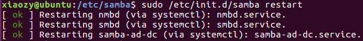

## 5.添加Samba用户名

```shell
sudo smbpasswd -a xiaozy
```

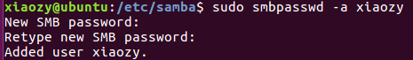

需要注意，此处可能抛出 <font color = red>Failed to add entry for user</font> <font color = blue>xxx</font> 的错误信息：

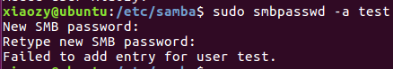

这是因为Samba只能将Linux系统账号添加为Samba用户，此时需要在系统添加相关账号。

## 6.获取ip地址

```shell
ifconfig
```

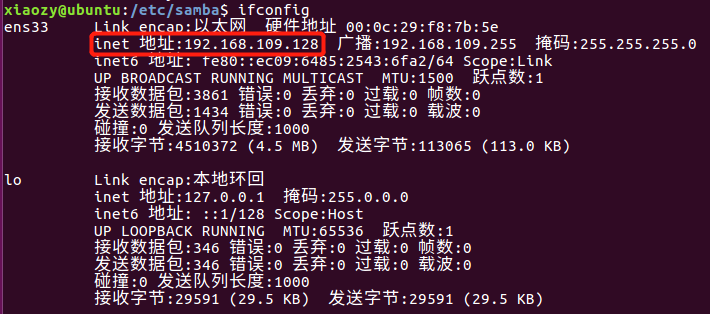

## 7.配置windows

“我的电脑” -> 右键 -> “映射网络驱动器”：

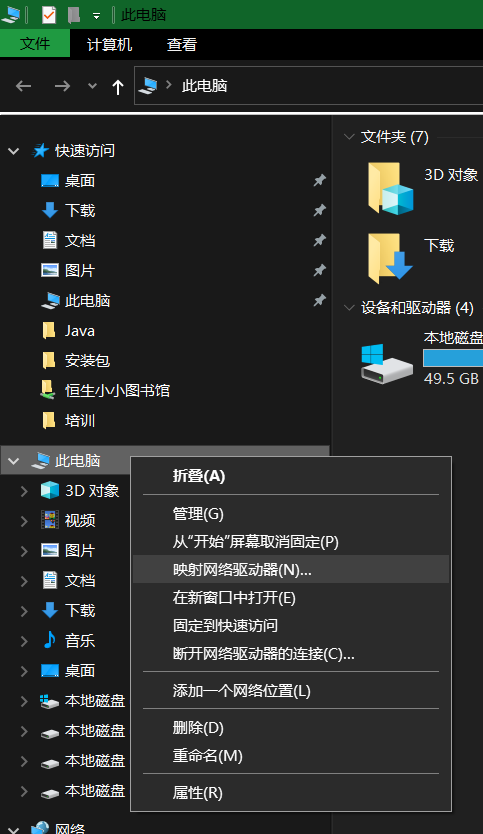

输入地址：\\\ + 服务器ip地址 + \ + Samba共享资源名称

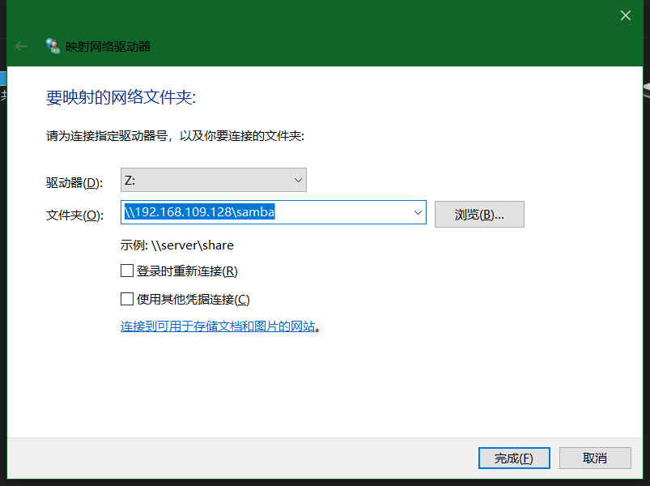

登录Samba账号：

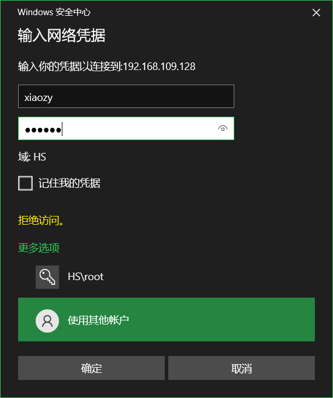

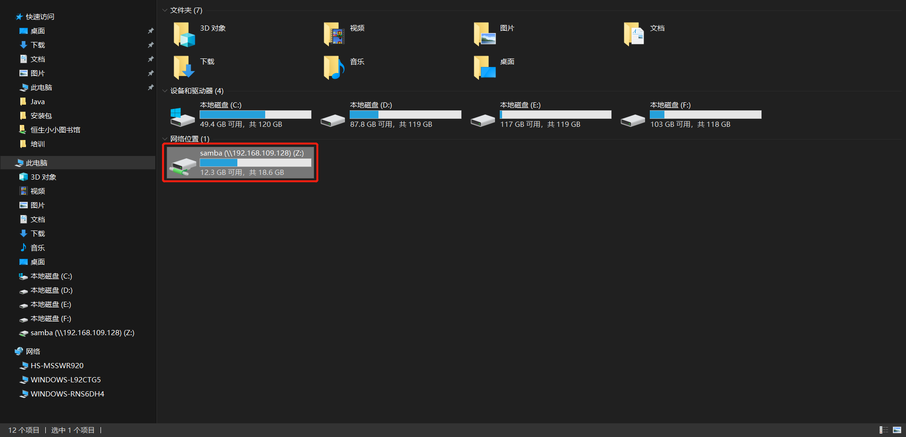

## 8.验证

linux在该共享文件夹在创建一个txt文件：

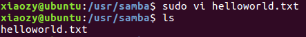

window从该共享文件夹打开该txt文件，正常打开，说明”读权限“配置正常：

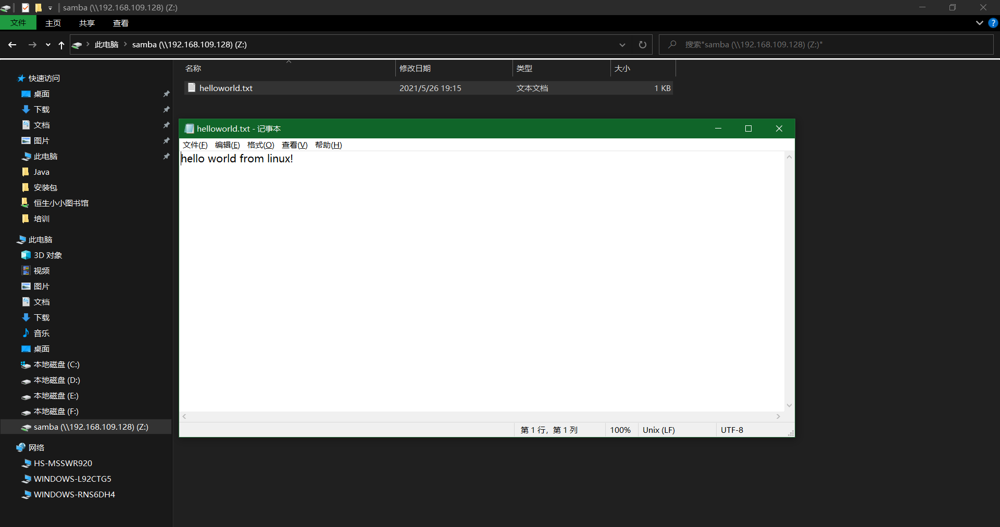

windows，修改并保存该txt文件：

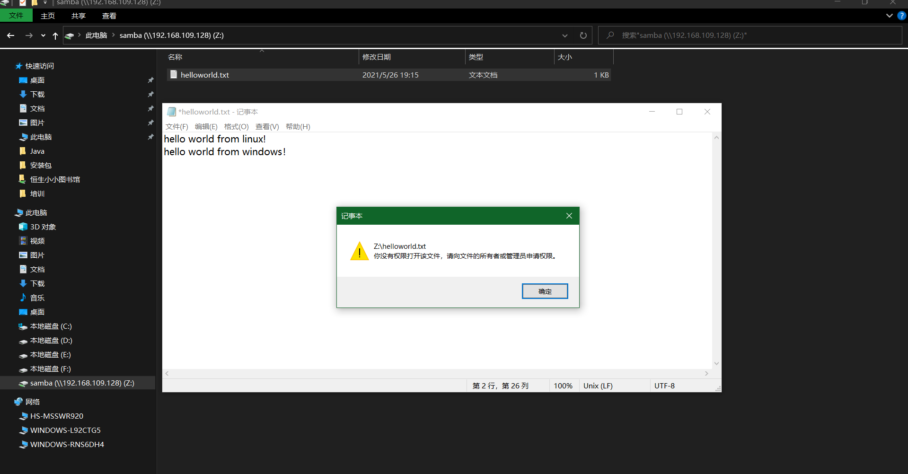

出现权限提示，说明”写权限“配置出现问题，可能的原因有2个：

1.  Samba没有配置好写权限
2.  Linux没有放开该文件夹的写权限

在Linux查看该文件夹的权限信息：

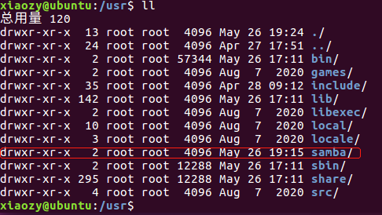

修改文件夹访问权限：

```shell
sudo chmod -R 777 ./samba/
```

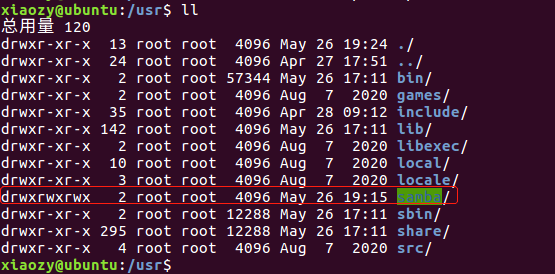

重新尝试在windows修改共享文件夹下的文件：

（保存成功）

在linux查看编辑后的文件，可以看到windows上编辑的内容：

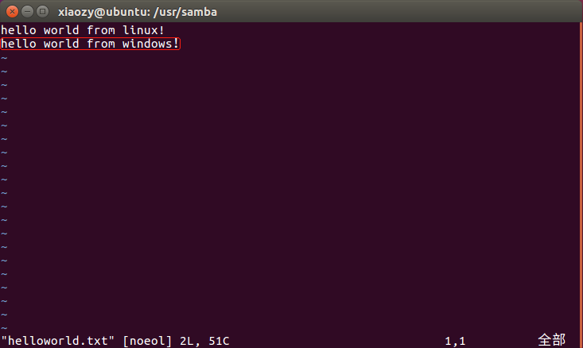