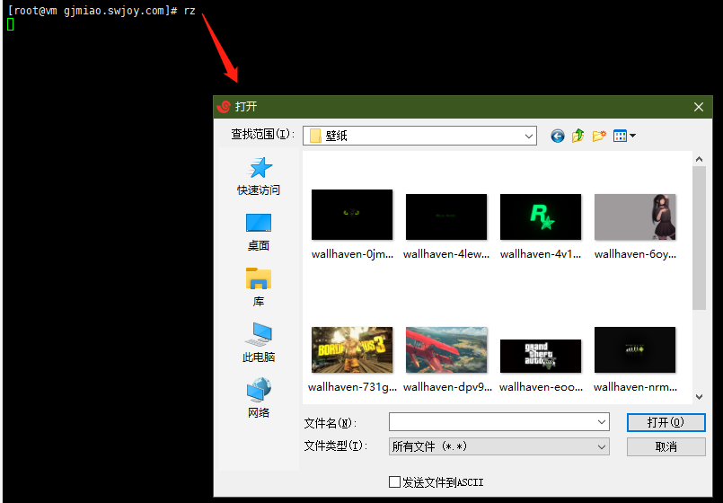
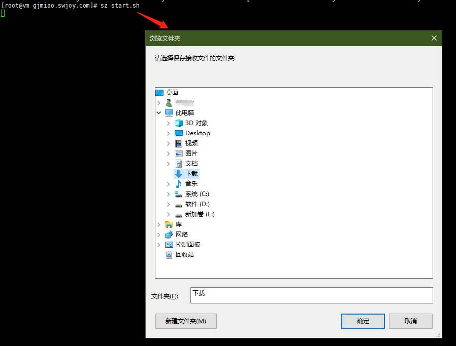

# Linux 系统文件上传与下载

---

>   一直以来都是使用 Xftp 进行 Linux 系统的文件上传与下载，直到今天 Xftp 没法用了，于是不得不寻找替代方案。

-   rz：rz 命令用于从本地系统上传文件至 Linux
-   sz：sz 命令用于从 Linux 下载文件至本地系统

### 使用 rz 命令

在窗口中输入 rz 命令并回车，接着会弹出一个窗口，在该窗口选择需要上传的文件即可。

### 使用 sz 命令

在窗口中输入 sz [文件名1,文件名2,..] 命令并回车，接着就会开始下载文件。

