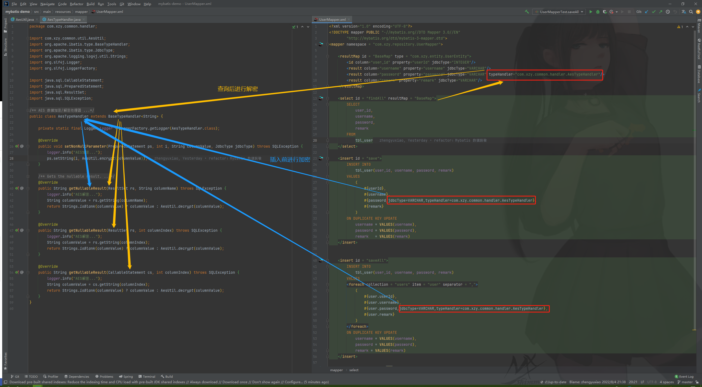

# Mybatis 数据脱敏

---

## 一般方案|通用方案

在业务层手动的对即将插入数据库的敏感数据进行加密，在业务层手动的对从数据库查询出的敏感数据进行解密。

**优点**：通用性较好，不依赖持久化框架的特性

**缺点**：对业务代码是侵入式的，需要对业务代码进行修改


## 基于 TypeHandler 的方案

自定义 TypeHandler ，在相关中实现敏感数据加密、解密的逻辑。在 xml 文件中为敏感字段指定 TypeHandler。

**优点**：对业务代码是非侵入式的，无序对业务代码进行修改

**缺点**：只对 MyBatis 有用




加密工具：（这里展示的是 AES 加密工具）

```java
package com.xzy.common.util;

import cn.hutool.core.util.HexUtil;
import cn.hutool.crypto.SecureUtil;
import org.apache.logging.log4j.util.Strings;

/**
 * AES 加密/解密工具
 *
 * @author xzy.xiao
 * @date 2022/8/4  20:54
 */
public class AesUtil {

    private static final String KEY_STR = "ad1725339b2dd0a68903c57b635942ca";
    private static final byte[] KEY_BYTES;

    static {
        KEY_BYTES = new byte[16];
        int i = 0;
        for (byte b : KEY_STR.getBytes()) {
            KEY_BYTES[i++ % 16] ^= b;
        }
    }

    public static String encrypt(String content) {
        if (Strings.isBlank(content)) {
            return content;
        }
        return HexUtil.encodeHexStr(SecureUtil.aes(KEY_BYTES).encrypt(content), false);
    }

    public static String decrypt(String content) {
        if (Strings.isBlank(content)) {
            return content;
        }
        return SecureUtil.aes(KEY_BYTES).decryptStr(content);
    }

    public static void main(String[] args) {
        String encrypted = encrypt("测试");
        System.out.println(encrypted);
        System.out.println(decrypt(encrypted));
    }
}
```

TypeHandler：

```java
package com.xzy.common.handler;

import com.xzy.common.util.AesUtil;
import org.apache.ibatis.type.BaseTypeHandler;
import org.apache.ibatis.type.JdbcType;
import org.apache.logging.log4j.util.Strings;
import org.slf4j.Logger;
import org.slf4j.LoggerFactory;

import java.sql.CallableStatement;
import java.sql.PreparedStatement;
import java.sql.ResultSet;
import java.sql.SQLException;

/**
 * AES 数据加密/解密处理器
 *
 * @author xzy.xiao
 * @date 2022/8/4  21:05
 */
public class AesTypeHandler extends BaseTypeHandler<String> {

    private static final Logger logger = LoggerFactory.getLogger(AesTypeHandler.class);

    @Override
    public void setNonNullParameter(PreparedStatement ps, int i, String columnValue, JdbcType jdbcType) throws SQLException {
        logger.info("AES加密...");
        ps.setString(i, AesUtil.encrypt(columnValue)); // 加密、解密方案可以根据业务需要进行调整
    }

    @Override
    public String getNullableResult(ResultSet rs, String columnName) throws SQLException {
        logger.info("AES解密...");
        String columnValue = rs.getString(columnName);
        return Strings.isBlank(columnValue) ? columnValue : AesUtil.decrypt(columnValue);
    }

    @Override
    public String getNullableResult(ResultSet rs, int columnIndex) throws SQLException {
        logger.info("AES解密...");
        String columnValue = rs.getString(columnIndex);
        return Strings.isBlank(columnValue) ? columnValue : AesUtil.decrypt(columnValue);
    }

    @Override
    public String getNullableResult(CallableStatement cs, int columnIndex) throws SQLException {
        logger.info("AES解密...");
        String columnValue = cs.getString(columnIndex);
        return Strings.isBlank(columnValue) ? columnValue : AesUtil.decrypt(columnValue);
    }
}
```

XML：

```xml
<?xml version="1.0" encoding="UTF-8"?>
<!DOCTYPE mapper PUBLIC "-//mybatis.org//DTD Mapper 3.0//EN"
        "http://mybatis.org/dtd/mybatis-3-mapper.dtd">
<mapper namespace = "com.xzy.repository.UserMapper">
    
    <resultMap id = "BaseMap" type = "com.xzy.entity.UserEntity">
        <id column="user_id" property="userId" jdbcType="INTEGER"/>
        <result column="username" property="username" jdbcType="VARCHAR"/>
        <result column="password" property="password" jdbcType="VARCHAR" typeHandler="com.xzy.common.handler.AesTypeHandler"/>
        <result column="remark" property="remark" jdbcType="VARCHAR"/>
    </resultMap>
    
    <select id = "findAll" resultMap = "BaseMap">
        SELECT
            user_id,
            username,
            password,
            remark
        FROM
            tbl_user
    </select>
    
    <insert id = "save">
        INSERT INTO
            tbl_user(user_id, username, password, remark)
        VALUES
            (
                #{userId},
                #{username},
                #{password,jdbcType=VARCHAR,typeHandler=com.xzy.common.handler.AesTypeHandler},
                #{remark}
            )
        ON DUPLICATE KEY UPDATE
            username = VALUES(username),
            password = VALUES(password),
            remark   = VALUES(remark)
    </insert>
    
    
    <insert id = "saveAll">
        INSERT INTO
            tbl_user(user_id, username, password, remark)
        VALUES
        <foreach collection = "users" item = "user" separator = ",">
            (
                #{user.userId},
                #{user.username},
                #{user.password,jdbcType=VARCHAR,typeHandler=com.xzy.common.handler.AesTypeHandler},
                #{user.remark}
            )
        </foreach>
        ON DUPLICATE KEY UPDATE
            username = VALUES(username),
            password = VALUES(password),
            remark = VALUES(remark)
    </insert>
    
    <delete id="deleteAll">
        DELETE FROM tbl_user
    </delete>
</mapper>
```

