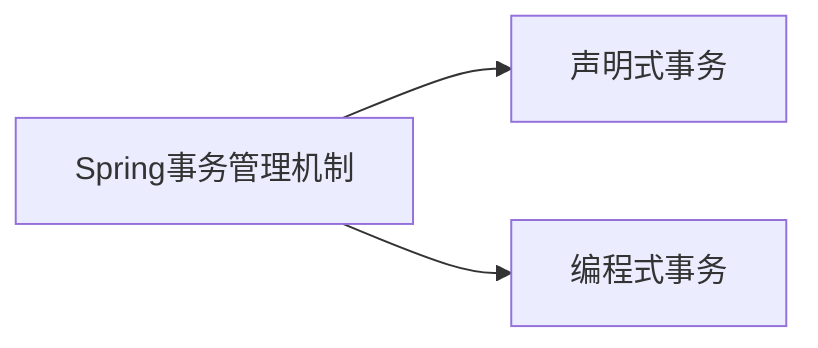

# @Transactional事务

---

[toc]



## 基础回顾

### ACID

事务具有4个特性：原子性、一致性、隔离性、持久性，简称事务的ACID特性。

-   **原子性**：事务是数据库执行的基本单位，事务的原子性就是指在事务的执行结果只有两种，要么全部成功，要么全部失败，不存在部分成功，部分失败的情况。
-   **一致性：**事务的执行不能破坏数据库数据的完整性和一致性，事务执行前后，数据库都始终处于一致性状态。如果数据库系统在运行过程中发生故障，有些事务尚未完成就被迫中断，这些未完成的事务对数据库所作的修改有一部分已写入物理数据库，这是数据库就处于一种不正确的状态，也就是不一致的状态。
-   **隔离性：**事务的隔离性是指在并发环境中，并发的事务时相互隔离的，一个事务的执行不能不被其他事务干扰。不同的事务并发操作相同的数据时，每个事务都有各自完成的数据空间，即一个事务内部的操作及使用的数据对其他并发事务时隔离的，并发执行的各个事务之间不能相互干扰。在标准SQL规范中，定义了4个事务隔离级别，不同的隔离级别对事务的处理不同，分别是：未授权读取，授权读取，可重复读取和串行化。
-   **持久性：**一旦事务提交，那么它对数据库中的对应数据的状态的变更就会永久保存到数据库中。--即使发生系统崩溃或机器宕机等故障，只要数据库能够重新启动，那么一定能够将其恢复到事务成功结束的状态

### 隔离级别

-   **未授权读取/未提交读**：该隔离级别允许脏读取，其隔离级别最低；比如事务A和事务B同时进行，事务A在整个执行阶段，会将某数据的值从1开始一直加到10，然后进行事务提交，此时，事务B能够看到这个数据项在事务A操作过程中的所有中间值（如1变成2，2变成3等），而对这一系列的中间值的读取就是未授权读取。
-   **授权读取/已提交读**：授权读取只允许获取已经提交的数据。比如事务A和事务B同时进行，事务A进行+1操作，此时，事务B无法看到这个数据项在事务A操作过程中的所有中间值，只能看到最终的10。
-   **可重复读**：就是保证在事务处理过程中，多次读取同一个数据时，其值都和事务开始时刻是一致的，因此该事务级别禁止不可重复读取和脏读取，但是有可能出现幻影数据。所谓幻影数据，就是指同样的事务操作，在前后两个时间段内执行对同一个数据项的读取，可能出现不一致的结果。在上面的例子中，可重复读取隔离级别能够保证事务B在第一次事务操作过程中，始终对数据项读取到1，但是在下一次事务操作中，即使事务B（注意，事务名字虽然相同，但是指的是另一个事务操作）采用同样的查询方式，就可能读取到10。
-   **串行化**：是最严格的事务隔离级别，它要求所有事务被串行执行，即事务只能一个接一个的进行处理，不能并发执行。


## 编程式事务

```java
@Service
public class TransactionalMain {
    private final TransactionTemplate transactionTemplate;

    @Autowired
    public TransactionalMain(PlatformTransactionManager platformTransactionManager) {
        this.transactionTemplate = new TransactionTemplate(platformTransactionManager);
    }

    public void test() {
        transactionTemplate.execute(new TransactionCallbackWithoutResult() {
            @Override
            protected void doInTransactionWithoutResult(TransactionStatus status) {
                try {
                    // do something
                } catch (Exception e) {
                    // rollback
                    status.setRollbackOnly();
                }
            }
        });
    }
}
```

## 声明式事务

```java
@EnableTransactionManagement
@Configuration
public class TransactionalConfig {}
```

```java
@Service
public class TransactionalMain {
    @Transactional
    public void test() {
        // do something
    }
}
```

### 声明式事务的优点

从上面的例子其实已经可以看出，声明式事务帮助我们减少了很多代码，程序员可以从事务管理中解放出来，可以更加专注于实现业务功能。

声明式事务是基于Spring AOP实现的，本质上就是在目标方法执行前后进行拦截，进行事务管理。使用这种方式，对代码没有侵入式，方法内只需要包含业务逻辑即可。

### 声明式事务的缺点

#### 1.粒度只能达到方法级别

由于Spring事务基于Spring AOP实现，因此，它的最小粒度只能达到方法级别。说人话：@Transactional不能添加到代码块上吧？不能对代码块进行事务管理吧？而上文的编程式事务是可以的。

因此，如果需要为一部分代码增加事务，就需要将这部分代码抽取成一个方法。

#### 2.声明式事务不够明显

因为声明式事务是通过注解的，有些时候还可以通过配置实现，这就会导致一个问题，那就是这个事务有可能被开发者忽略。

事务被忽略了有什么问题呢？

**首先，如果开发者没有注意到一个方法是被事务嵌套的，那么就可能会再方法中加入一些如RPC远程调用、消息发送、缓存更新、文件写入等操作。**我们知道，这些操作如果被包在事务中，有两个问题：

-   这些操作自身是无法回滚的，这就会导致数据的不一致。可能RPC调用成功了，但是本地事务回滚了，可是PRC调用无法回滚了。
-   在事务中有远程调用，就会拉长整个事务。那么久会导致本事务的数据库连接一直被占用，那么如果类似操作过多，就会导致<u>数据库连接池耗尽。</u>

#### 3.使用不当容易失效

除了事务的粒度问题，还有一个问题那就是声明式事务虽然看上去帮我们简化了很多代码，但是一旦没用对，也很容易导致事务失效。如以下几种场景就可能导致声明式事务失效：

-   @Transactional 应用在非 public 修饰的方法上

    private 方法上加@Transactional注解无效，private 方法调用具有@Transactional注解的 public 照样无效。

-   @Transactional 注解属性 propagation 设置错误

-   @Transactional 注解属性 rollbackFor 设置错误

-   同一个类中方法调用，导致@Transactional失效

-   异常被catch捕获导致@Transactional失效

-   数据库引擎不支持事务

因为Spring的事务是基于AOP实现的，但是在代码中，有时候我们会有很多切面，不同的切面可能会来处理不同的事情，多个切面之间可能会有相互影响。

在之前的一个项目中，我就发现我们的Service层的事务全都失效了，一个SQL执行失败后并没有回滚，排查下来才发现，是因为一位同事新增了一个切面，这个切面里面做个异常的统一捕获，导致事务的切面没有捕获到异常，导致事务无法回滚。