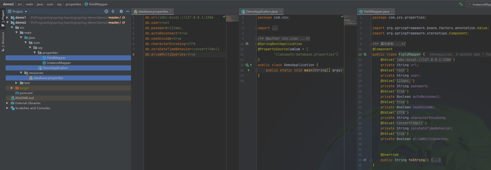
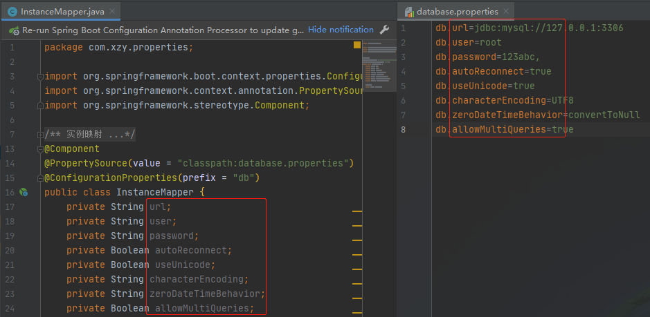

# Spring 配置文件映射

[toc]

在使用 Spring 的过程中，可能会遇到需要将配置文件中的值映射到属性或实体类的需求，下面简单记录一下两种需求的实现方式。

配置文件：database.properties

```properties
db.url=jdbc:mysql://127.0.0.1:3306
db.user=root
db.password=123abc,
db.autoReconnect=true
db.useUnicode=true
db.characterEncoding=UTF8
db.zeroDateTimeBehavior=convertToNull
db.allowMultiQueries=true
```

## 一、配置文件 → 属性

项目结构：



配置类：

```java
@SpringBootApplication
@PropertySource(value = {
        "classpath:database.properties"}
)
public class DemoApplication {
    public static void main(String[] args) {
        SpringApplication.run(DemoApplication.class, args);
    }
}
```

属性映射：

```java
@Component
public class FieldMapper {
    @Value("${db.url}")
    private String url;
    @Value("${db.user}")
    private String user;
    @Value("${db.password}")
    private String password;
    @Value("${db.autoReconnect}")
    private Boolean autoReconnect;
    @Value("${db.useUnicode}")
    private Boolean useUnicode;
    @Value("${db.characterEncoding}")
    private String characterEncoding;
    @Value("${db.zeroDateTimeBehavior}")
    private String zeroDateTimeBehavior;
    @Value("${db.allowMultiQueries}")
    private Boolean allowMultiQueries;

    ...
}
```

>   Note：
>
>   1.  @PropertySource 用于定位配置文件的位置。value 属性的类型是一个数组，这意味着可以同时定位多个配置文件
>   2.  @Value 用于读取配置文件中的值，并赋值给属性。

## 二、配置文件 → 实体类

实体类：

```java
@Component
@PropertySource(value = "classpath:database.properties")
@ConfigurationProperties(prefix = "db")
public class InstanceMapper {
    private String url;
    private String user;
    private String password;
    private Boolean autoReconnect;
    private Boolean useUnicode;
    private String characterEncoding;
    private String zeroDateTimeBehavior;
    private Boolean allowMultiQueries;
    
    ...
}
```

>   Note：
>
>   1.  @ConfigurationProperties 用于将配置文件中的值批量的映射到实体中的属性。配置文件中前缀后面的属性名称和实体类中的属性名称必须相同。
>
>       

