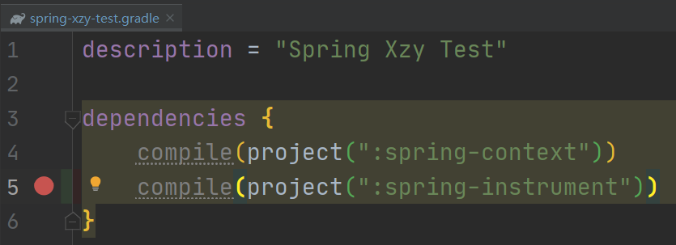

# Spring-Framework 源码阅读环境搭建

### 参考文章

1.   [Spring源码阅读环境搭建](https://xiaoshu.blog.csdn.net/article/details/90444714)
2.   [Spring源码阅读之在spring源码中创建一个gradle测试模块](https://xiaoshu.blog.csdn.net/article/details/94293328)

---

### 问题记录

#### 1、依赖下载不下来、下载速度很慢

解决方法：修改build.gradle文件，添加依赖仓库

``` 	groovy
buildscript {
   repositories {
      mavenLocal()
      maven { url 'https://maven.aliyun.com/repository/public/'}
      maven { url "https://maven.aliyun.com/repository/public"}
      maven { url 'https://maven.aliyun.com/repository/jcenter' }
      maven { url 'https://maven.aliyun.com/repository/google' }
      maven { url 'https://maven.aliyun.com/repository/central' }
      maven { url 'https://maven.aliyun.com/repository/gradle-plugin' }
      gradlePluginPortal()
      maven { url "https://repo.spring.io/plugins-release" }
   }
   dependencies {
      classpath("io.spring.gradle:propdeps-plugin:0.0.9.RELEASE")
      classpath("org.asciidoctor:asciidoctorj-pdf:1.5.0-alpha.16")
   }
}

allprojects {
    repositories {
      mavenLocal()
      maven { url 'https://maven.aliyun.com/repository/public/'}
      maven { url "https://maven.aliyun.com/repository/public"}
      maven { url 'https://maven.aliyun.com/repository/jcenter' }
      maven { url 'https://maven.aliyun.com/repository/google' }
      maven { url 'https://maven.aliyun.com/repository/central' }
      maven { url 'https://maven.aliyun.com/repository/gradle-plugin' }
        mavenCentral()
    }
}
```


#### 2、符号不存在

```text
Information:Kotlin: kotlinc-jvm 1.3.72 (JRE 1.8.0_73-b02)
Information:java: Errors occurred while compiling module 'spring.spring-context.main'
Information:javac 1.8.0_73 was used to compile java sources
Information:2021/12/14 12:36 - Build completed with 3 errors and 1 warning in 16 s 102 ms
Warning:Kotlin: Language version 1.1 is deprecated and its support will be removed in a future version of Kotlin
E:\CodingSpace\Spring-Framework\spring-context\src\main\java\org\springframework\context\weaving\DefaultContextLoadTimeWeaver.java
Error:(26, 38) java: 找不到符号
  符号:   类 InstrumentationSavingAgent
  位置: 程序包 org.springframework.instrument
E:\CodingSpace\Spring-Framework\spring-context\src\main\java\org\springframework\instrument\classloading\InstrumentationLoadTimeWeaver.java
Error:(26, 38) java: 找不到符号
  符号:   类 InstrumentationSavingAgent
  位置: 程序包 org.springframework.instrument
Error:(160, 32) java: 找不到符号
  符号:   变量 InstrumentationSavingAgent
  位置: 类 org.springframework.instrument.classloading.InstrumentationLoadTimeWeaver.InstrumentationAccessor
```

解决方法：修改当前模块的build.gradle文件，添加 testCompile(project(":spring-instrument"))


