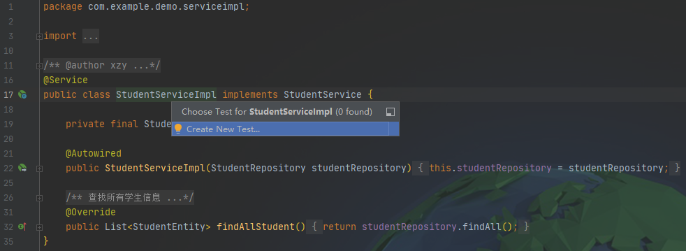
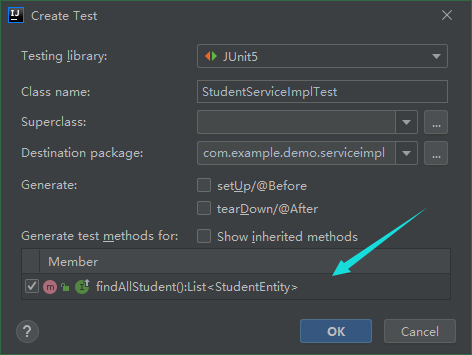
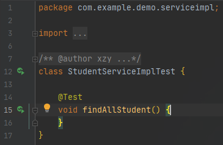
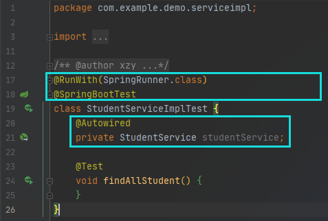
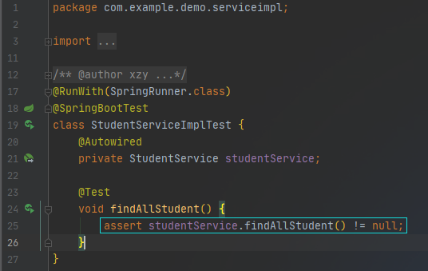
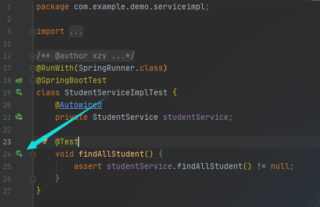
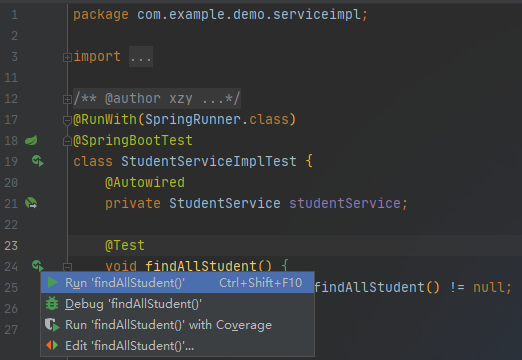

# Spring 项目单元测试

1. 创建测试类

    ①点击待测试类的类名

    

    ②使用快捷键Ctrl + Shift + T，进入测试类创建选择窗口：

    

    勾选需要测试的方法，点击OK，生成测试类。

    

    

2. 修改测试类

    

    注意：需要添加依赖包

    ```yaml
            <dependency>
                <groupId>org.springframework.boot</groupId>
                <artifactId>spring-boot-starter-test</artifactId>
            </dependency>
    ```

    3. 添加断言

        

        4. 运行单元测试

            

            