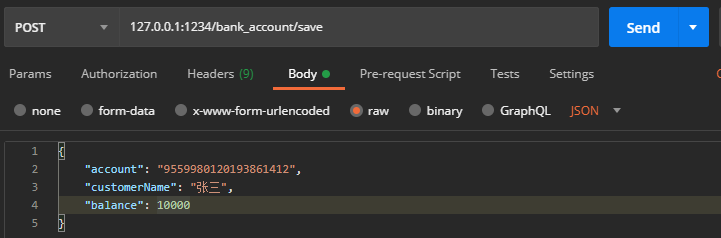

# Spring MVC 接收实体参数的处理过程

---

```java
/**
 * @author xzy
 * @date 2020-11-08 14:56
 * 说明：
 */
@RestController
@RequestMapping("bank_account/")
public class BankAccountController {

    ......
    
    @PostMapping("save")
    public Message save(@RequestBody BankAccountEntity newBankAccountRecord) {
       ......
    }
}
```

```java
public class BankAccountEntity{

    private String id;
    private String account;
    private String customerName;
    private BigDecimal balance;
    private String createBy;
    private Date createDate;
    private String updateBy;
    private Date updateDate;
    private String deleteFlag;

    // 实例初始化代码块
    {
        this.deleteFlag = "0";
        System.out.println("instance init code block.");
    }

    // 无参构造方法
    public BankAccountEntity() {
        System.out.println("BankAccountEntity()");
    }
    
    // 有参构造方法
    public BankAccountEntity(String account, String customerName, BigDecimal balance) {
        this.account = account;
        this.customerName = customerName;
        this.balance = balance;
    }

    // 各字段的set方法
    
    public void setId(String id) {
        this.id = id;
        System.out.println("setId(String id)");
    }

    public void setAccount(String account) {
        this.account = account;
        System.out.println("setAccount(String account)");
    }

    public void setCustomerName(String customerName) {
        this.customerName = customerName;
        System.out.println("setCustomerName(String customerName)");
    }

    public void setBalance(BigDecimal balance) {
        this.balance = balance;
        System.out.println("setBalance(BigDecimal balance)");
    }

    public void setCreateBy(String createBy) {
        this.createBy = createBy;
        System.out.println("setCreateBy(String createBy)");
    }

    public void setCreateDate(Date createDate) {
        this.createDate = createDate;
        System.out.println("setCreateDate(Date createDate)");
    }

    public void setUpdateBy(String updateBy) {
        this.updateBy = updateBy;
        System.out.println("setUpdateBy(String updateBy)");
    }

    public void setUpdateDate(Date updateDate) {
        this.updateDate = updateDate;
        System.out.println("setUpdateDate(Date updateDate)");
    }

    public void setDeleteFlag(String deleteFlag) {
        this.deleteFlag = deleteFlag;
        System.out.println("setDeleteFlag(String deleteFlag)");
    }
}
```



后端接收到请求后的控制台输出：

```
instance init code block.
BankAccountEntity()
setAccount(String account)
setCustomerName(String customerName)
setBalance(BigDecimal balance)
```

由此可见，Spring MVC 接收实例参数的处理过程是：执行初始化代码块、调用无参构造方法、调用参数对应的set方法。