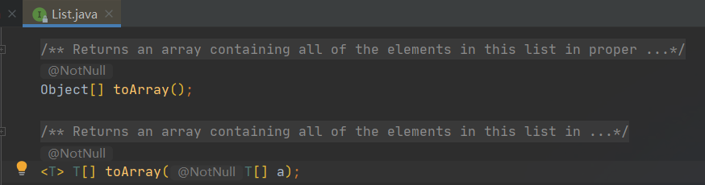

# 数组、集合相互转换问题

---

[TOC]


## 集合 → 数组

```java
public class Main2 {
    public static void main(String[] args) {
        List<Student> studentList = new ArrayList<>(3);
        studentList.add(new Student("张三", 21));
        studentList.add(new Student("李四", 22));
        studentList.add(new Student("王五", 23));
        // 正例：使用toArray(T[])，返回相同类型的数组。
        Student[] students = new Student[studentList.size()];
        studentList.toArray(students);
        // 反例：使用toArray()，返回Object数组。
        Object[] objects = studentList.toArray();
    }
}
```

List接口中定义了两个用于集合向数组转换的方法：



其中，无参方法返回Object数组；有参方法返回指定类型的数组。使用有参方法时需要注意：

1.  若传入数组的大小 > 集合大小，下标为[size()）的数组元素将置为null
2.  若传入数组的大小 < 集合大小，toArray方法内部会重新分配空间。

## 数组 → 集合

```java
public class Main2 {
    public static void main(String[] args) {
        Student[] students = new Student[10];
        students[0] = new Student("张三", 21);
        students[1] = new Student("李四", 22);
        students[2] = new Student("王五", 23);
        List<Student> studentList = Arrays.asList(students);

        // 反例：使用工具类 Arrays . asList() 把数组转换成集合时，不能使用其修改集合相关的方法，
        // 它的add / remove / clear 方法会抛出 UnsupportedOperationException 异常。
        studentList.add(new Student("", 10));
        studentList.remove(3);
        studentList.clear();
    }
}
```