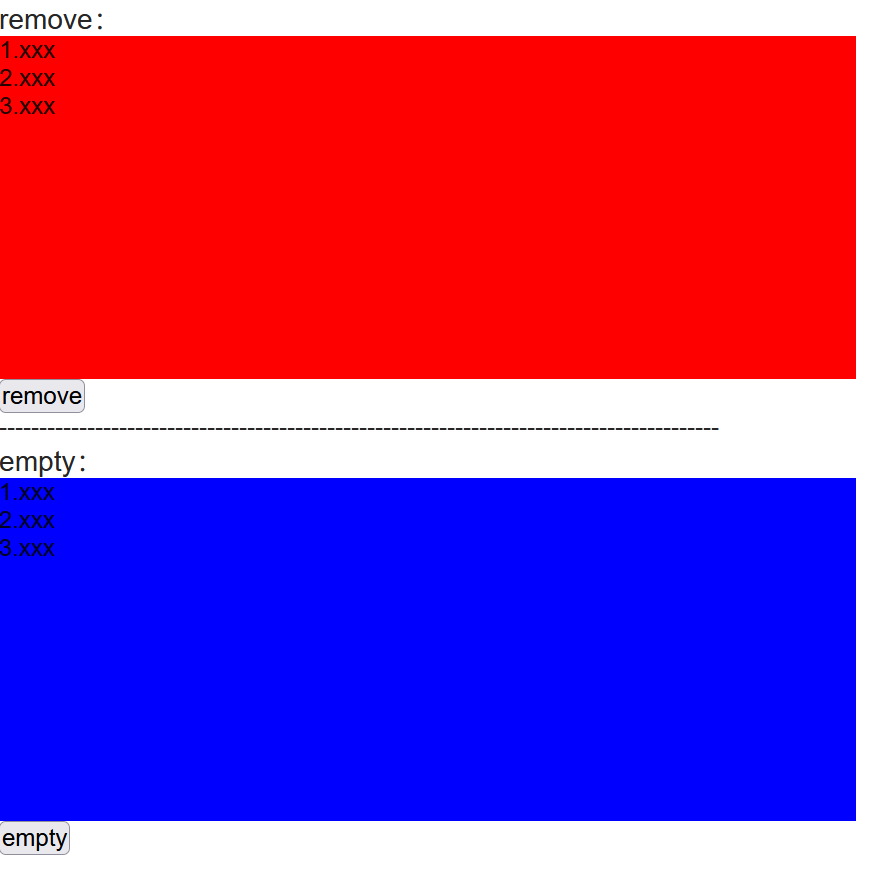
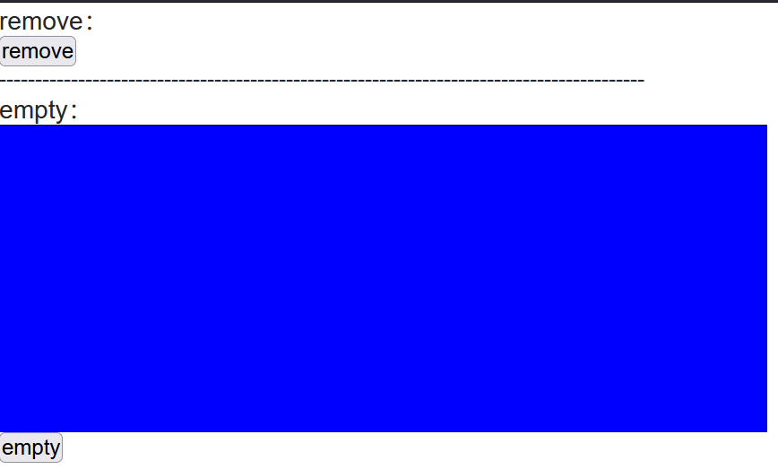

# JQuery 的 remove 与 empty 方法

---

代码：

```html
<div>

    <div>
        <h3>remove：</h3>
        <div id="removeTestPlace" style="width: 500px;height: 200px;background: red">
            <p>1.xxx</p>
            <p>2.xxx</p>
            <p>3.xxx</p>
        </div>
        <button id="removeTestButton">remove</button>
    </div>

    <p>------------------------------------------------------------------------------------------</p>

    <div>
        <h3>empty：</h3>
        <div id="emptyTestPlace" style="width: 500px;height: 200px;background: blue">
            <p>1.xxx</p>
            <p>2.xxx</p>
            <p>3.xxx</p>
        </div>
        <button id="emptyTestButton">empty</button>
    </div>
</div>
```

```js
$("#removeTestButton").on("click", function () {
    $("#removeTestPlace").remove(); // 元素自己也会被删除
});

$("#emptyTestButton").on("click", function () {
    $("#emptyTestPlace").empty(); // 元素的子元素被删除
});
```


页面：




点击 remove 按钮：


点击 empty 按钮：




总结：

1.   使用 remove 方法的时候，调用方法的元素自己也会被删除

     ```js
     $("#removeTestPlace").remove();
     
     // 等价：
     
     document.getElementById("removeTestPlace").remove();
     ```

2.   使用 empty 方法的时候，调用方法的元素不会被删除，但内容会被清空

     ```js
     $("#emptyTestPlace").empty();
     
     // 等价：
     
     document.getElementById("emptyTestPlace").innerText = "";
     ```

