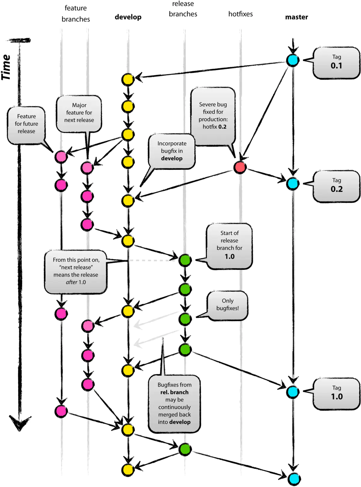
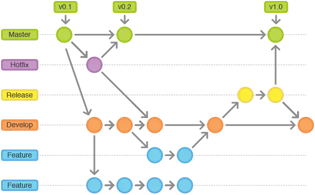

# Git 分支命名规范

---

Git 版本管理需要一个清晰的流程和规范，为此可以参考 Vincent Driessen 提出的 Git Flow 流程：

主要的几个分支

-   生产分支（Production）
-   开发分支（Develop）
-   功能分支（Feature）
-   发布分支（Release）
-   修复分支（Hotfix）

**生产分支（Master）**：生产分支也就是我们常说的 Master 分支，这个分支上存储的是最新发布到生产环境的代码。不能直接在 Master 上修改代码，Master 的代码只能从 Release、HotFix 合并

**开发分支（Develop）**：这个分支是主开发分支，包含所有要发布到下一个 Release 分支的代码。不能直接在 Develop 分支上修改代码，Develop 的代码只能从其他分支合并，例如 Feature、HotFix

**功能分支（Feature）**：这个分支主要用来开发一个新的功能，一旦功能完成 Feature 的代码就会被合并到 Develop，然后 Feature 机会被删除。

**发布分支（Release）**：当完成一定的功能或修复一定的BUG，我们会从 Develop 切出一个 Release 用于发布代码

**修复分支（Hotfix）**：当 Master 中发现了 Bug，切出一个 Hotfix 用于修复 BUG。BUG 修复完成后，Hotfix 会被合并到 Master 以及 Develop。

