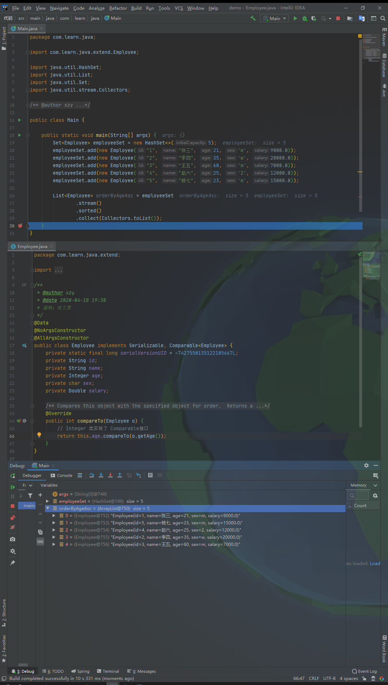
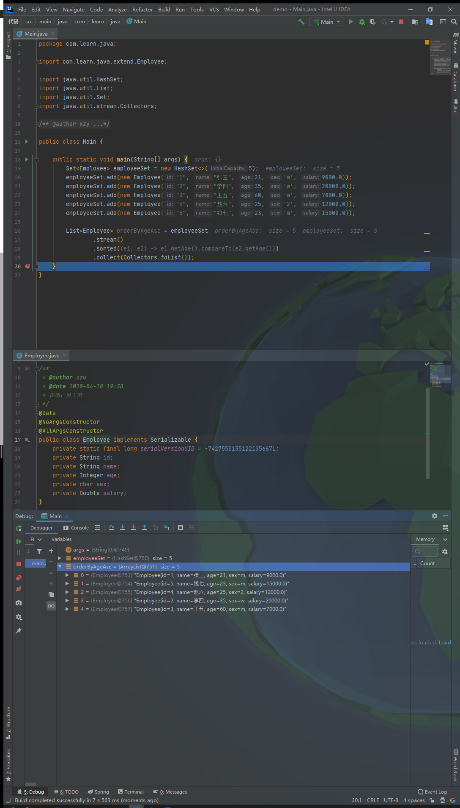

# 排序集合中的对象

## 1.源码介绍

### 1.1 Stream<T> sorted()

源码查看：

```java
/**
 * Returns a stream consisting of the elements of this stream, sorted
 * according to natural order.  If the elements of this stream are not
 * {@code Comparable}, a {@code java.lang.ClassCastException} may be thrown
 * when the terminal operation is executed.
 *
 * <p>For ordered streams, the sort is stable.  For unordered streams, no
 * stability guarantees are made.
 *
 * <p>This is a <a href="package-summary.html#StreamOps">stateful
 * intermediate operation</a>.
 *
 * @return the new stream
 */
Stream<T> sorted();
```

说明：T 必须是实现了 Comparable 接口的类，否则方法会抛出 ClassCastException 异常。


### 1.2. Stream<T> sorted(Comparator<? super T> comparator)

源码查看：

```java
/**
 * Returns a stream consisting of the elements of this stream, sorted
 * according to the provided {@code Comparator}.
 *
 * <p>For ordered streams, the sort is stable.  For unordered streams, no
 * stability guarantees are made.
 *
 * <p>This is a <a href="package-summary.html#StreamOps">stateful
 * intermediate operation</a>.
 *
 * @param comparator a <a href="package-summary.html#NonInterference">non-interfering</a>,
 *                   <a href="package-summary.html#Statelessness">stateless</a>
 *                   {@code Comparator} to be used to compare stream elements
 * @return the new stream
 */
Stream<T> sorted(Comparator<? super T> comparator);
```

说明：根据给定的 **比较器** 进行排序。Comparator是一个函数式接口，其源码如下（仅展示关键部分）：

```java
@FunctionalInterface
public interface Comparator<T> {
    /**
     * Compares its two arguments for order.  Returns a negative integer,
     * zero, or a positive integer as the first argument is less than, equal
     * to, or greater than the second.<p>
     * 
     * ......（此处略去部分注释）
     *
     * @param o1 the first object to be compared.
     * @param o2 the second object to be compared.
     * @return a negative integer, zero, or a positive integer as the
     *         first argument is less than, equal to, or greater than the
     *         second.
     * @throws NullPointerException if an argument is null and this
     *         comparator does not permit null arguments
     * @throws ClassCastException if the arguments' types prevent them from
     *         being compared by this comparator.
     */
    int compare(T o1, T o2);
```

说明：方法的返回值分类以及含义如下：

- 负数：o1 小于 o2
- 0：o1 等于 o2
- 正数：o1 大于 o2

## 3. 使用

### 3.1 Stream<T> sorted()



### 3.2 Stream<T> sorted(Comparator<? super T> comparator)

