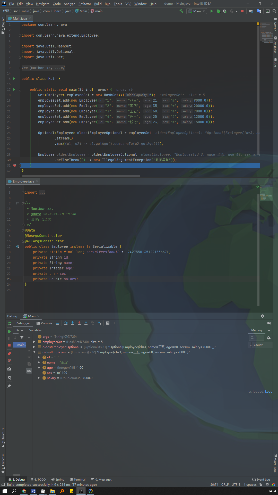

# Java Stream 寻找集合中的最大值、最小值

### 相关源码：

```java
/**
 * Returns the minimum element of this stream according to the provided
 * {@code Comparator}.  This is a special case of a
 * <a href="package-summary.html#Reduction">reduction</a>.
 *
 * <p>This is a <a href="package-summary.html#StreamOps">terminal operation</a>.
 *
 * @param comparator a <a href="package-summary.html#NonInterference">non-interfering</a>,
 *                   <a href="package-summary.html#Statelessness">stateless</a>
 *                   {@code Comparator} to compare elements of this stream
 * @return an {@code Optional} describing the minimum element of this stream,
 * or an empty {@code Optional} if the stream is empty
 * @throws NullPointerException if the minimum element is null
 */
@NotNull
Optional<T> min(Comparator<? super T> comparator);
```

```java
/**
 * Returns the maximum element of this stream according to the provided
 * {@code Comparator}.  This is a special case of a
 * <a href="package-summary.html#Reduction">reduction</a>.
 *
 * <p>This is a <a href="package-summary.html#StreamOps">terminal
 * operation</a>.
 *
 * @param comparator a <a href="package-summary.html#NonInterference">non-interfering</a>,
 *                   <a href="package-summary.html#Statelessness">stateless</a>
 *                   {@code Comparator} to compare elements of this stream
 * @return an {@code Optional} describing the maximum element of this stream,
 * or an empty {@code Optional} if the stream is empty
 * @throws NullPointerException if the maximum element is null
 */
@NotNull
Optional<T> max(Comparator<? super T> comparator);
```

```java
@FunctionalInterface
public interface Comparator<T> {
    /**
     * Compares its two arguments for order.  Returns a negative integer,
     * zero, or a positive integer as the first argument is less than, equal
     * to, or greater than the second.<p>
     *
     * ......（略去部分）
     *
     * @param o1 the first object to be compared.
     * @param o2 the second object to be compared.
     * @return a negative integer, zero, or a positive integer as the
     *         first argument is less than, equal to, or greater than the
     *         second.
     * @throws NullPointerException if an argument is null and this
     *         comparator does not permit null arguments
     * @throws ClassCastException if the arguments' types prevent them from
     *         being compared by this comparator.
     */
    int compare(T o1, T o2);
}
```

### 使用案例：

