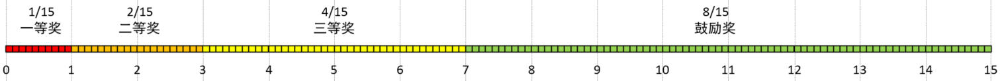
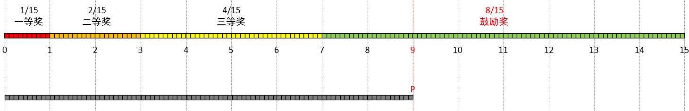

# 权重 + 随机

参考文章：[基于权重的随机选择算法](https://zhuanlan.zhihu.com/p/146216606)

---

**应用场景**

-   抽奖：奖品池中价值越低的奖品抽中的概率越高
-   视频推荐：如果用户查看某类视频的频次较高，可以提高该类视频的推荐频率
-   负载均衡：如果某个实例的响应速度较快，可以将更多的流量分发到该实例
-   …


**实现思路**：线性扫描

开发中可能会遇到这样的需求：从奖品池中随机抽取奖品发给玩家，不同价格的奖品被抽中的概率不同——价值越高，被抽中的概率越低。

实现按权重随机的最简单方法就是线性扫描：大概的思想就是，为所有奖品设置权重，并计算出权重总和S，然后生成一个[0,S)区间内的随机数P，接着从头向后扫描奖品列表，并不断从P扣去奖品的权重值。当P小于某个道具的权重值时，这个道具就是抽中的那一个。




<center>图1. 奖品、权重</center>




<center>图2. 随机抽取</center>

优化：

1.   根据权重值对数据进行升序排列——把抽中概率高的数据放在列表前部，减小遍历的次数，但时间复杂度还是O(N)
2.   二叉查找，先计算出总和列表，列表中每个值是前面N个权重值的总和，这样这个列表就是有序的，再对这个列表使用二叉查找得到权重索引


代码：

```java
    /**
     * 带权重的随机决策——基于线性扫描
     * 注意：
     * 1. 时间复杂度O(n)，n = prizePool.length
     * 2. 将权重大的数据靠前，可以减少列表遍历的次数
     *
     * @param prizePool  - “奖品池”，即需要决策的数据
     * @param weightPool - “奖品权重”，即数据所占的权重（决定数据被选中的概率）
     * @param <E>        - 数据类型
     * @return - 随机抽中的“奖品”
     */
    public static <E> E randomDecisionWithWeight(E[] prizePool, int[] weightPool) {
        if (prizePool.length == 0 || prizePool.length != weightPool.length) {
            throw new IllegalArgumentException();
        }

        /*
         * 奖品池、奖品权重：
         *
         *      A      B           C                       D
         *   |-----|-------|---------------|-------------------------------|
         *    1/15    2/15        4/15                    8/15
         *
         *  生成一个[0,15)区间内的随机数x，根据x所处的子区间决定抽取到的奖品：
         *                                     x
         *  |----------------------------------|
         */

        // 计算总权重，确定随机数生成范围
        int weightSum = 0;
        for (int weight : weightPool) {
            if (weight < 0) {
                throw new IllegalArgumentException("权重不允许是负数！");
            }
            weightSum += weight;
        }

        // 抽取数据
        int randomPrizePoint = new Random().nextInt(weightSum);
        E randomPrize = null;
        for (int i = 0; i < weightPool.length; i++) {
            if (randomPrizePoint < weightPool[i]) {
                randomPrize = prizePool[i];
                break;
            } else {
                randomPrizePoint -= weightPool[i];
            }
        }

        return randomPrize;
    }

    public static void main(String[] args) {
        String[] prizePool = new String[]{"一等奖", "二等奖", "三等奖", "鼓励奖"};
        int[] prizeWeight = new int[]{1, 2, 4, 8};

        Map<String, Integer> count = new HashMap<>(4);
        for (int i = 0; i < 1000; i++) {
            String randomPrize = randomDecisionWithWeight(prizePool, prizeWeight);
            count.put(randomPrize, count.getOrDefault(randomPrize, 0) + 1);
            System.out.println(randomPrize);
        }

        System.out.println("统计：" + count);
    }
```

