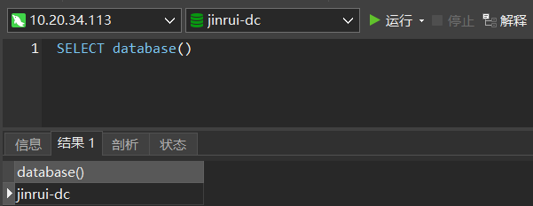
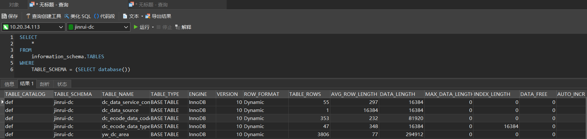
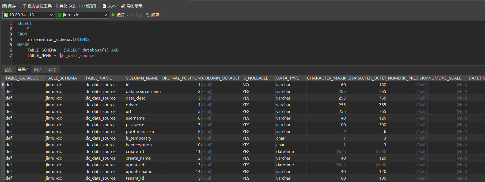

# MySQL 获取当前数据库所有表以及表字段信息

<(￣︶￣)↗[参考文章](https://www.pianshen.com/article/4078174508/)

---

1.   查询当前数据库

     ```mysql
     SELECT database()
     ```

     

     

2.   查询当前数据库所有表

     ```mysql
     SELECT 
         *
     FROM
         information_schema.TABLES
     WHERE
         TABLE_SCHEMA = (SELECT database())
     ```

     

     

3.   查询当前数据库指定表的所有字段

     ```mysql
     SELECT 
         * 
     FROM 
         information_schema.COLUMNS 
     WHERE 
         TABLE_SCHEMA = (SELECT database()) AND
         TABLE_NAME = 'xxx'
     ```

     

