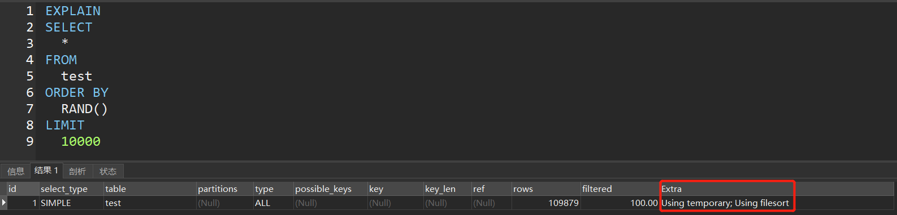
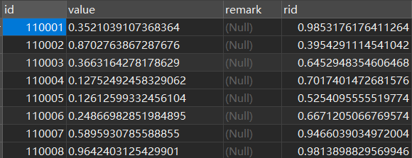
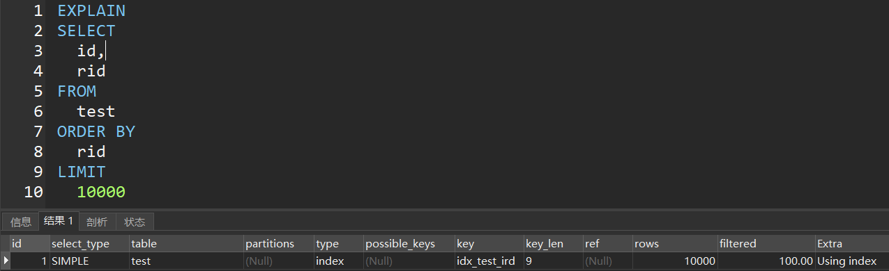
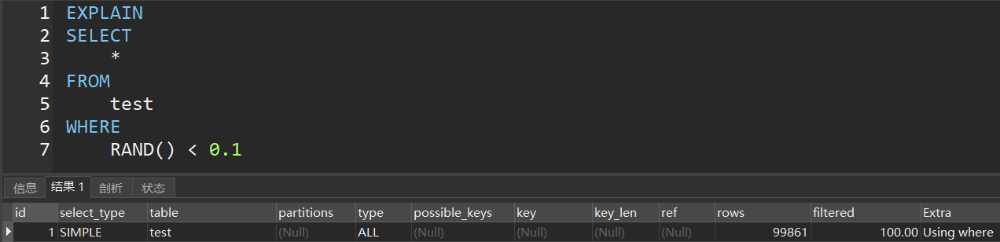

# MySQL随机抽取数据

---

### 方案1

```mysql
-- 从test表随机抽取10000条数据
SELECT
    * 
FROM
    test
ORDER BY
    RAND()
LIMIT 
    10000
```

分析：效率很低



### 方案2

在方案1的基础上进行改进：test表新增一个字段rid，并在该字段上创建索引，每次往test表插入数据时都需要往rid字段存一个随机数据，查询的时候使用该字段进行排序……



分析：存储无用的数据、维护索引



### 方案3

```mysql
-- 随机抽取10%的数据
SELECT
    *
FROM
    test
WHERE
    RAND() < 0.1
```



RAND()方法产生一个0~1之间的浮点数，上面的方法在数据量足够大的时候更准确。