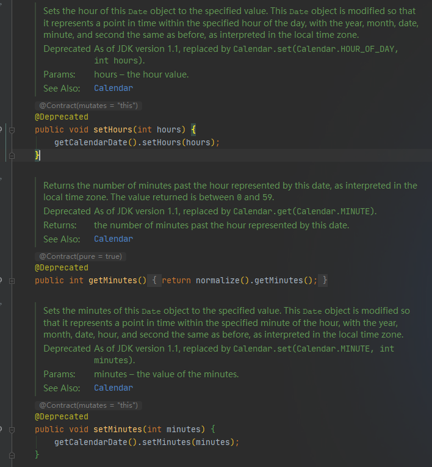

# 获取系统当前日期

有些时候，我们只需要获取当前的年月日信息，在一些老的系统中，可能使用如下语句：

```java
public class Main {
    public static void main(String[] args) {
        
        Date today = new Date();
        today.setHours(0);
        today.setMinutes(0);
        today.setSeconds(0);
        
    }
}
```

目前，Date 类的 setHours 、 setMinutes 、setSeconds 方法已经被标注为弃用，并且，推荐编程人员改用 Calendar 类的 set 方法操作时间：



下面是通过使用Calendar 类的 set 方法获取系统当前日期的代码：

```java
public class Main {
    public static void main(String[] args) {
        
        Calendar calendar = Calendar.getInstance();
        calendar.set(Calendar.HOUR_OF_DAY, 0);
        calendar.set(Calendar.MINUTE, 0);
        calendar.set(Calendar.SECOND, 0);
        Date today = calendar.getTime();
        
    }
}
```