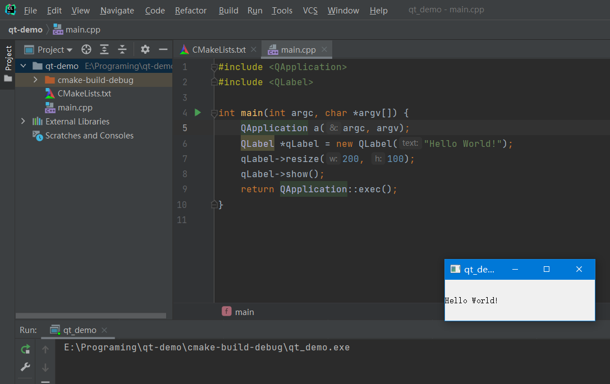

# CLion + Qt

### 版本说明

CLion 版本：2021.2.2

Qt 版本：5.9.1

### 环境搭建

1.   下载并安装 CLion （详细过程不做赘述）

     

2.   下载 Qt：https://download.qt.io/archive/qt/5.9/5.9.1/

     

     

3.   下载完成开始安装：

     ① Next

     

     ② Skip

     

     ③ 选择安装目录（**路径中不能有中文**）

     

     ④ 选择要安装的部分

     

     ⑤ 安装

     

     ⑥ 安装完成

     

4.   CLion + Qt 的一个简单 Demo

     ① 在 CLion 创建 Qt 项目

     

     ② 修改 CLion 的 “Toolchains”

     

     ③编译、启动程序

     

     

     

     >   Qt 的目录结构很奇怪：
     >
     >   