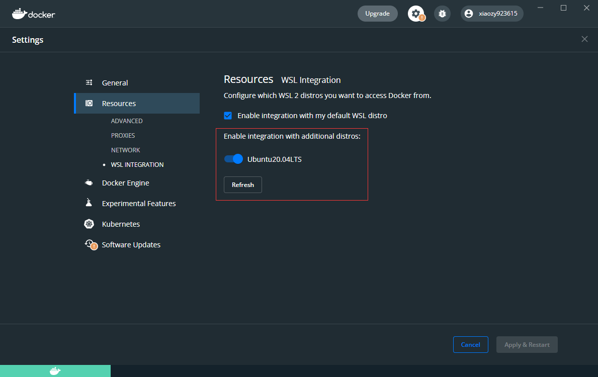
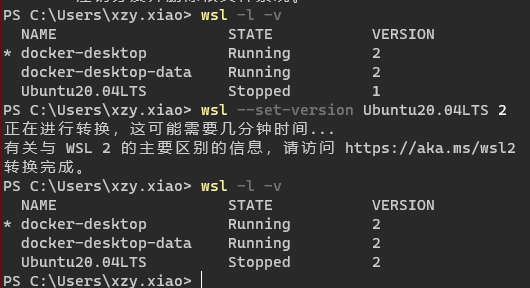

# DockerDesktop配置

## 1、Resources



>   Note：
>
>   可能遇到“You don’t have any WSL 2 distro. Please convert a WSL 1 distro to WSL 2”的错误提示，解决方案可以参考这篇官网上的[文章](https://forums.docker.com/t/docker-resources-you-dont-have-any-wsl-2-distro-please-convert-a-wsl-1-distro-to-wsl-2/99100)
>
>   我的解决过程：
>
>   
>
>   

## 2、Docker Engine

```json
{
  "builder": {
    "gc": {
      "defaultKeepStorage": "20GB",
      "enabled": true
    }
  },
  "debug": false,
  "experimental": false,
  "features": {
    "buildkit": true
  },
  "insecure-registries": [],
  "registry-mirrors": [
    "https://docker.mirrors.ustc.edu.cn",
    "http://aad0405c.m.daocloud.io",
    "https://registry.docker-cn.com",
    "http://hub-mirror.c.163.com",
    "https://3laho3y3.mirror.aliyuncs.com",
    "http://f1361db2.m.daocloud.io",
    "https://mirror.ccs.tencentyun.com"
  ]
}
```

