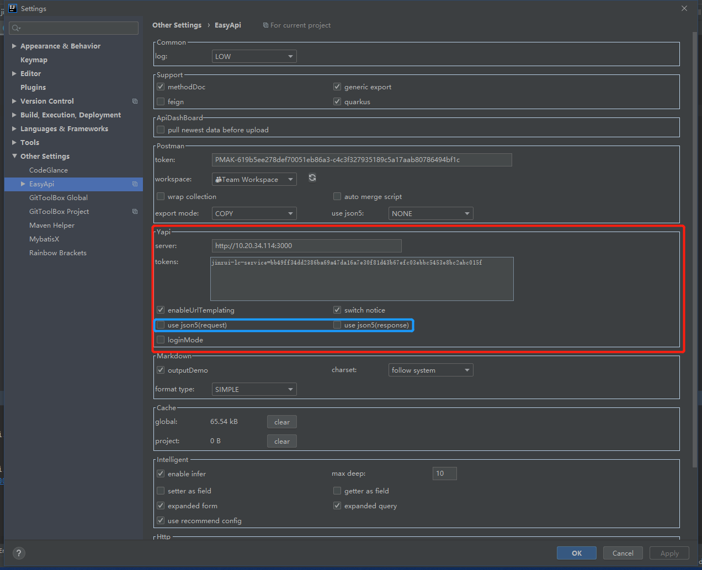
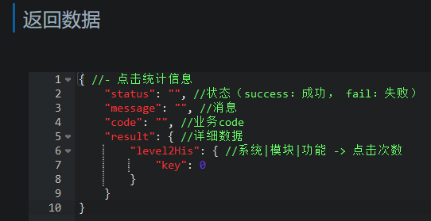

# IDEA + YAPI

参考文章：https://www.cnblogs.com/allennote/articles/13154966.html

---

1.   安装插件

     

2.   配置插件

     

-   use json5(requets)、use json5(response)：勾选的结果是，Yapi中直接使用JSON格式来描述参数；不勾选的结果是，Yapi中使用表格来描述参数。

    

    

    