# IDEA 插件

[toc]

## jclasslib bytecode viewer

功能：查看字节码

使用：https://blog.csdn.net/w605283073/article/details/103209221

## Alibaba Java Coding Guidelines

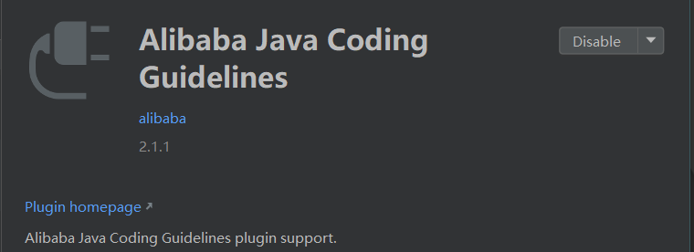

## GodeGlance

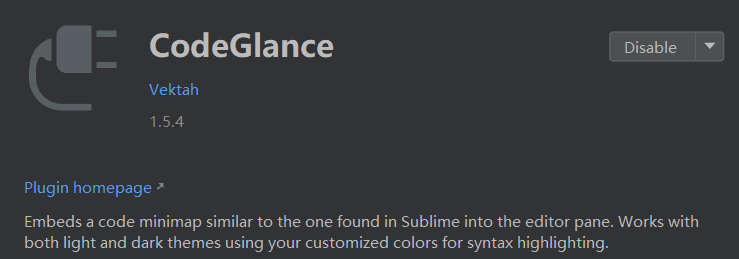

## EasyYapi

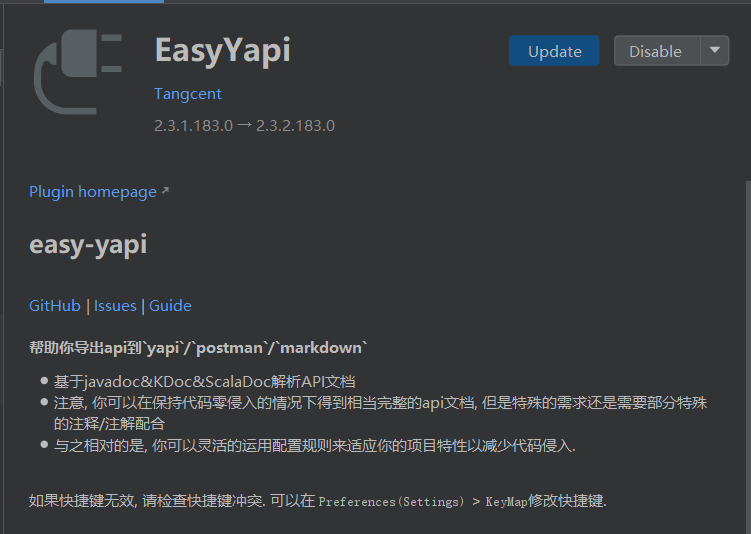

## Git Commit Template

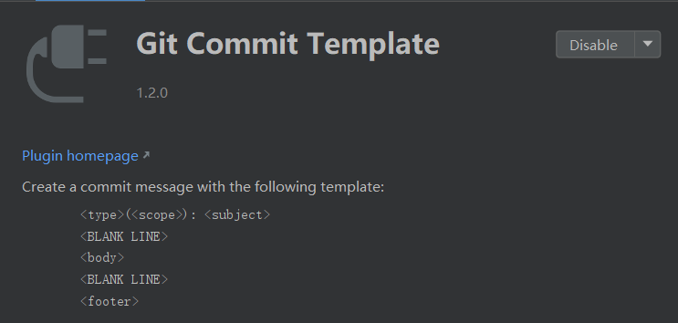

## GitToolBox

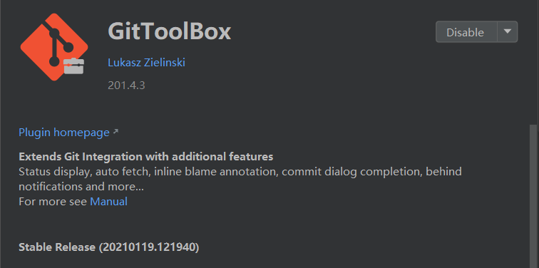

## Lombok

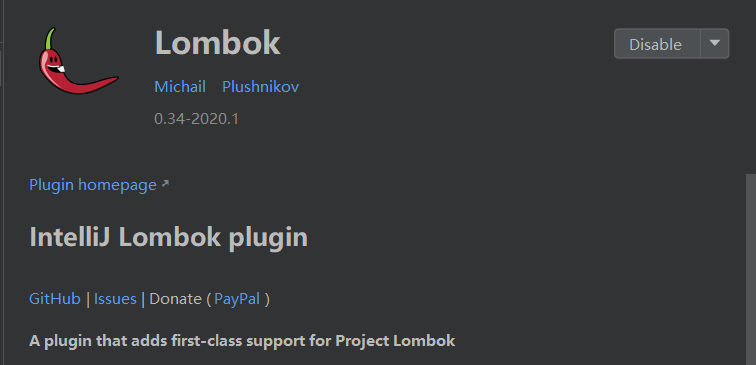

## Maven Helper

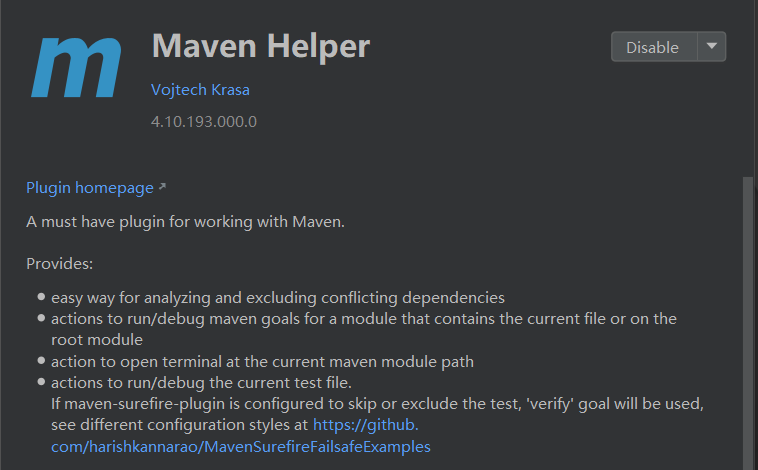

## MyBatisX

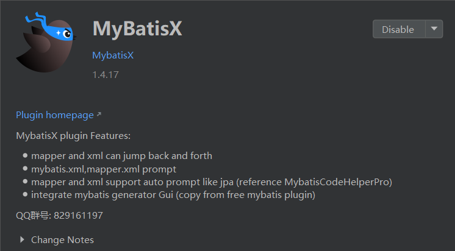

## POJO to JSON

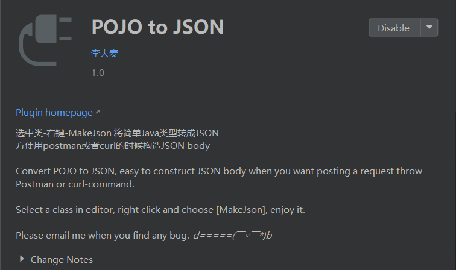

## Rainbow Brackets

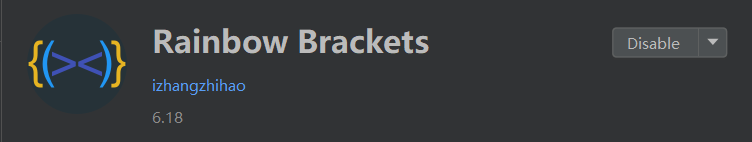

## RestfulTool

## SonarLint

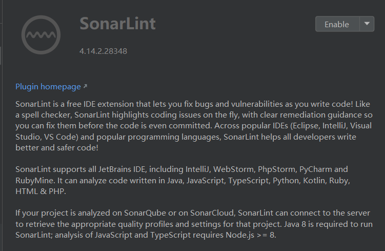

## Translation

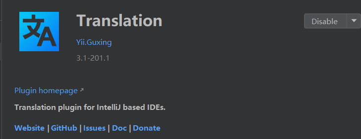