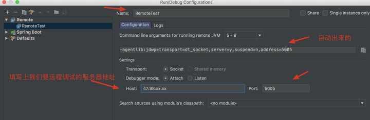

# IDEA 远程调试

>   原文地址：https://zhuanlan.zhihu.com/p/98116873


当把一个本地项目部署到远程服务器后有可能出现意想不到错误，这个时候通过远程调试能够更清楚的找到bug所在位置。本篇主要讲解如何使用 IDEA 开发工具进行远程调试

1.  服务器上面的 SpringBoot 项目（内嵌 Tomcat）
2.  服务器上运行在 Tomcat 中的项目


## 一、远程调试 SpringBoot 项目

1.  在远程服务器上启动 SpringBoot 项目要添加一些参数

    ```shell
    java -agentlib:jdwp=transport=dt_socket,server=y,suspend=n,address=5005 -jar xxx.jar
    ```

    如下图所示：

    

    

2.  打开 IDEA 的 Run/Debug Configurations 新增一个 Remote

    

    

    

    

3.  填写远程服务的 IP 及端口号

    

    

4.  IDEA 上启动 Remote

    启动成功会看到 console 打印 Connected to 。。。表示连接成功了

    


## 二、远程调试 Tomcat 项目

1.  打开 tomcat bin 路径下的 catalina.sh，找到 JPDA_ADDRESS

    

2.  **把默认的 localhost:8000 改成 0.0.0.0:5005**

    >   Note：localhost:8000 默认本地调试，也就是无法远程调试 ，改成 0.0.0.0 表示所有的 ip 都可以调试

    

3.  重启 tomcat

    启动命令：

    ```shell
    ./catalina.sh jpda start （jpda start 表示调试模式启动的意思）
    ```

    >   注意：如果 5005 端口已经被占用，那就换一个端口，同时修改 IDEA 中 Remote 的配置

    