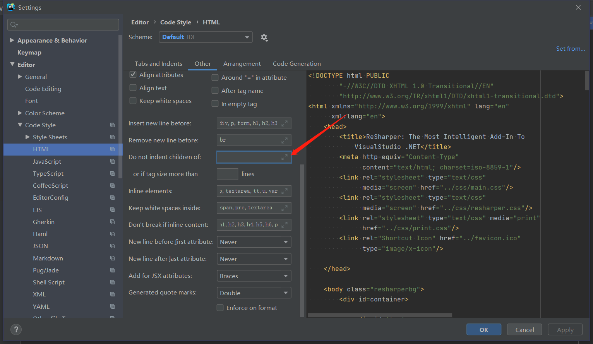

默认的格式化效果：

```html
<!DOCTYPE html>
<html lang="en">
<head>
    <meta charset="UTF-8">
    <title>页面标题</title>
</head>
<body>
<h1>XXX</h1>
</body>
</html>
```

修改后的格式化效果：

```html
<!DOCTYPE html>
<html lang="en">
    <head>
        <meta charset="UTF-8">
        <title>页面标题</title>
    </head>
    <body>
        <h1>XXX</h1>
    </body>
</html>
```


修改方式：

