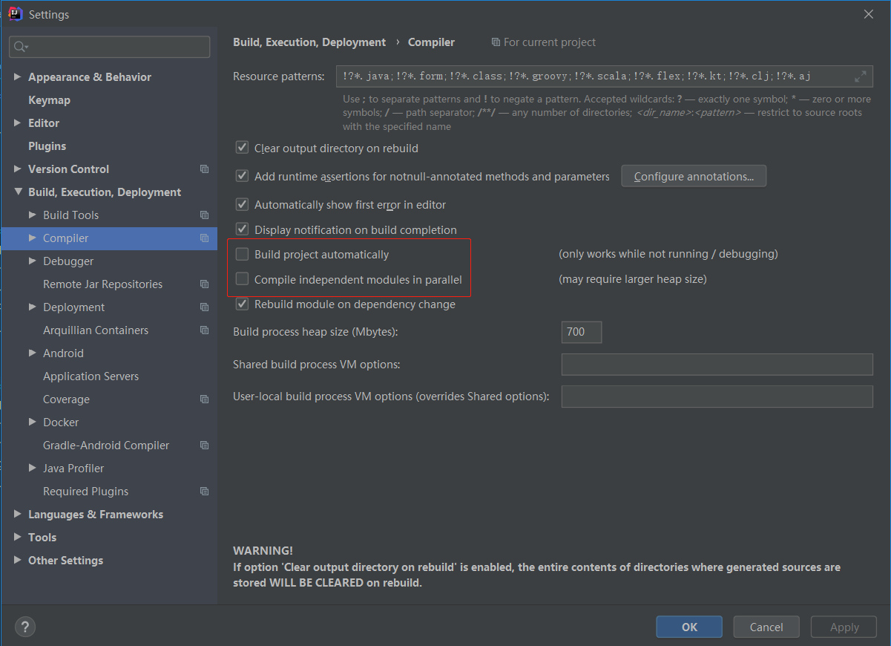
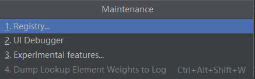
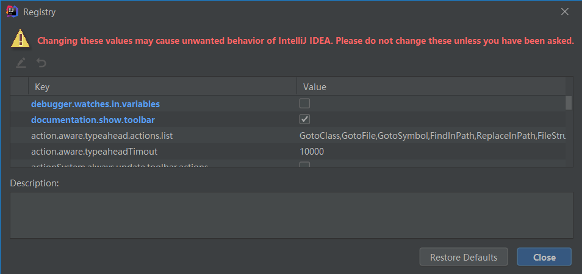

# 热部署

1.   Adding devtools to your project

     ```xml
     <dependency>
         <groupId>org.springframework.boot</groupId>
         <artifactId>spring-boot-devtools</artifactId>
         <scope>runtime</scope>
         <optional>true</optional>
     </dependency>
     ```

2.   Adding plugin to your pom.xml

     ```xml
     <build>
         <plugins>
             <plugin>
                 <groupId>org.springframework.boot</groupId>
                 <artifactId>spring-boot-maven-plugin</artifactId>
                 <configuration>
                     <fork>true</fork>
                     <addResources>true</addResources>
                 </configuration>
             </plugin>
         </plugins>
     </build>
     ```

3.   Enabling automatic build

     

4.   Update the value of registry

     （1）ctrl + shift + alt + /

     

     （2）Registry

     

     （3）√

     

     

     

5.   Restart IDEA