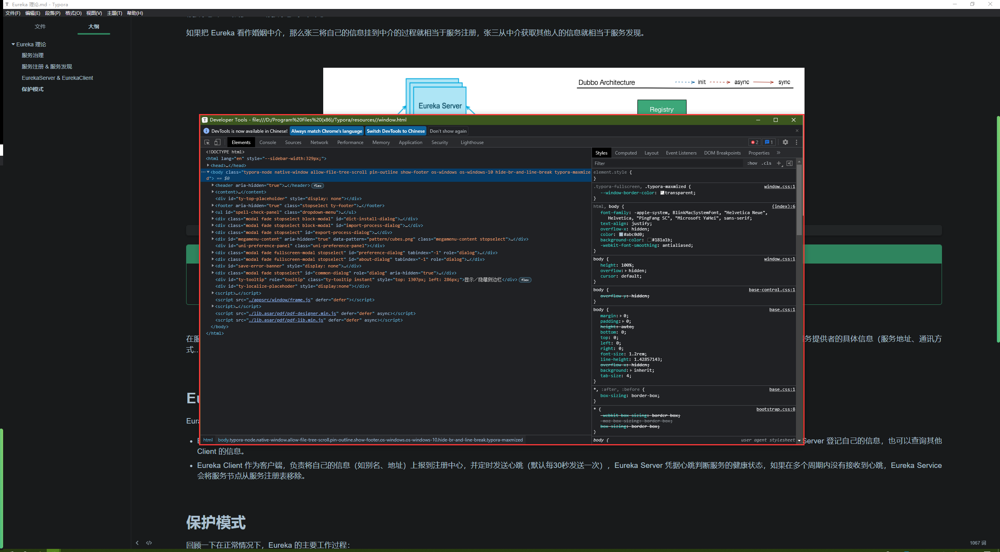
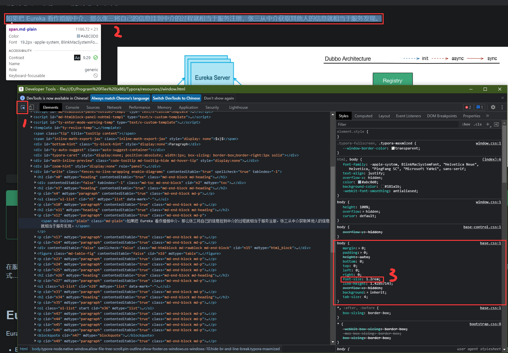
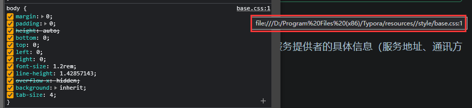
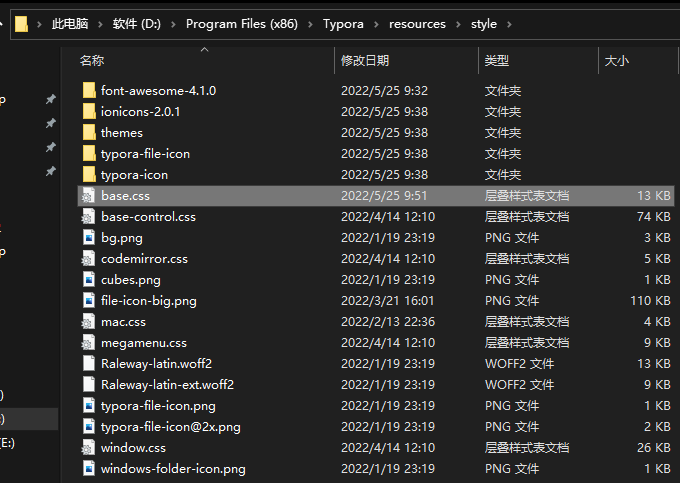
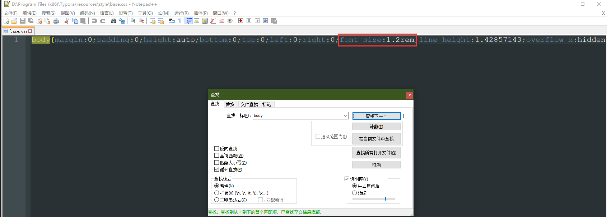

# Typora 自定义样式

### 1、高亮

首先需要在 Typora 的偏好设置中开启对高亮的支持：


打开主题对应的 css 文件，找到 mark 样式：


在 mark 处自定义 Typora 高亮显示效果，例如：

```css
mark {
    color: red
}
```

### 2、段落高度

```css
/* paragraph */
p {
  margin-top: 0;
  margin-bottom: 1.5rem;
}
```


### 3、字体大小

1.   Shift + F12

     

     >   Note：是不是看着眼熟？我估计 Typora 就是内嵌了一个 Chrome 内核

2.   查看到底是哪个样式影响了文本大小

     

3.   看看这个样式文件在哪里

     

4.   找到并打开样式文件，检索`body`，修改 font-size 属性

     

     
