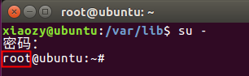

# Ubuntu root用户

---

## 切换root用户

打开终端，输入一下命令：

```shell
su -
```

根据提示输入root用户的密码，即可切换到root用户。



## Ubuntu默认的root密码是多少？如何修改？

Ubuntu的默认root密码是随机的，即每次开机都有一个新的root密码。可以在终端输入命令 sudo passwd，然后输入当前用户的密码，终端会提示输入新的密码并确认，此时的密码就是root新密码。修改成功后，输入命令 su root，再输入新的密码就ok了。