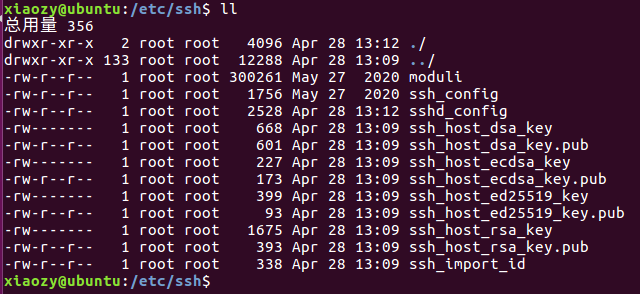
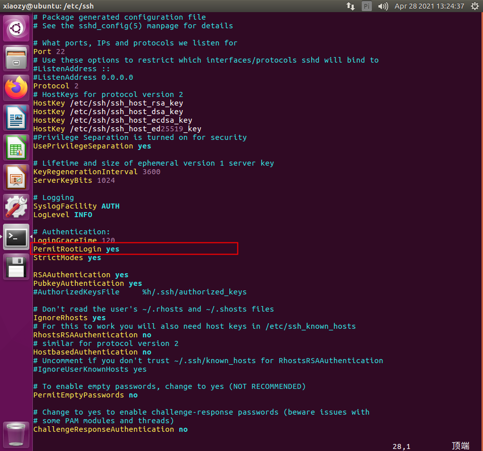
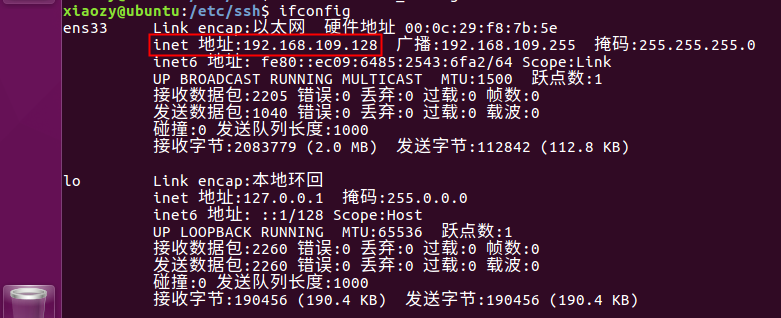

# XShell连接Ubuntu虚拟机

---

参考文档：https://www.cnblogs.com/zevfang/p/6596008.html

1.  关闭本机和目标机防火墙

    查看Ubuntu防火墙状态：

    ```shell
    sudo ufw status
    ```

    关闭Ubuntu防火墙：

    ```shell
    sudo ufw disable
    ```

    开启Ubuntu防火墙：

    ```shell
    sudo ufw enable
    ```

2.  安装ssh

    检查ssh是否安装：（进入 /etc/ssh/ 如果存在下图的内容，说明ssh已经安装）

    ```shell
    cd /etc/ssh/
    ```

    

    安装ssh：

    ```shell
    sudo apt-get install openssh-server
    ```

3.  修改sshd_config文件

    ```shell
    sudo vim sshd_config
    ```

    

4.  查看虚拟机IP地址

    ```shell
    ifconfig
    ```

    

5.  使用Xshell连接Ubuntu