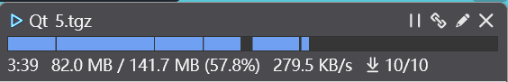
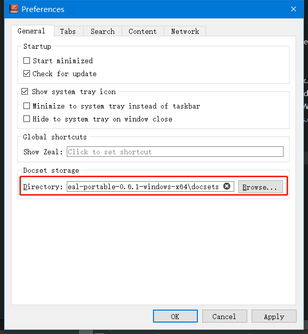

# 文档下载速度慢的解决办法

方案来自知乎：https://zhuanlan.zhihu.com/p/412337978

---

1、按照下列各式编辑下载链接，将连接丢到浏览器就能直接下载文档：

>   http://{CITY_NAME}.kapeli.com/feeds/{DOC_NAME}.tgz

>   参数说明：
>
>   -   CITY_NAME：服务器所在城，从快到慢 tokyo、singapore、sanfrancisco、frankfurt…
>   -   DOC_NAME：文档名称（遇到空格使用“_”连接）

2、将下载并解压好的文档放到 Zeal 的文档存储位置即可

>   文档存储位置：Edit -> Preferences
>
>   