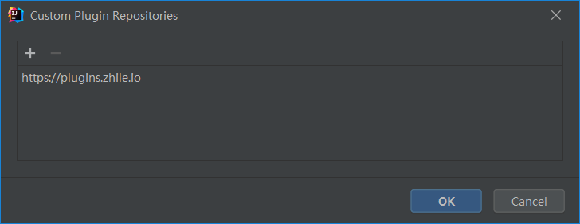
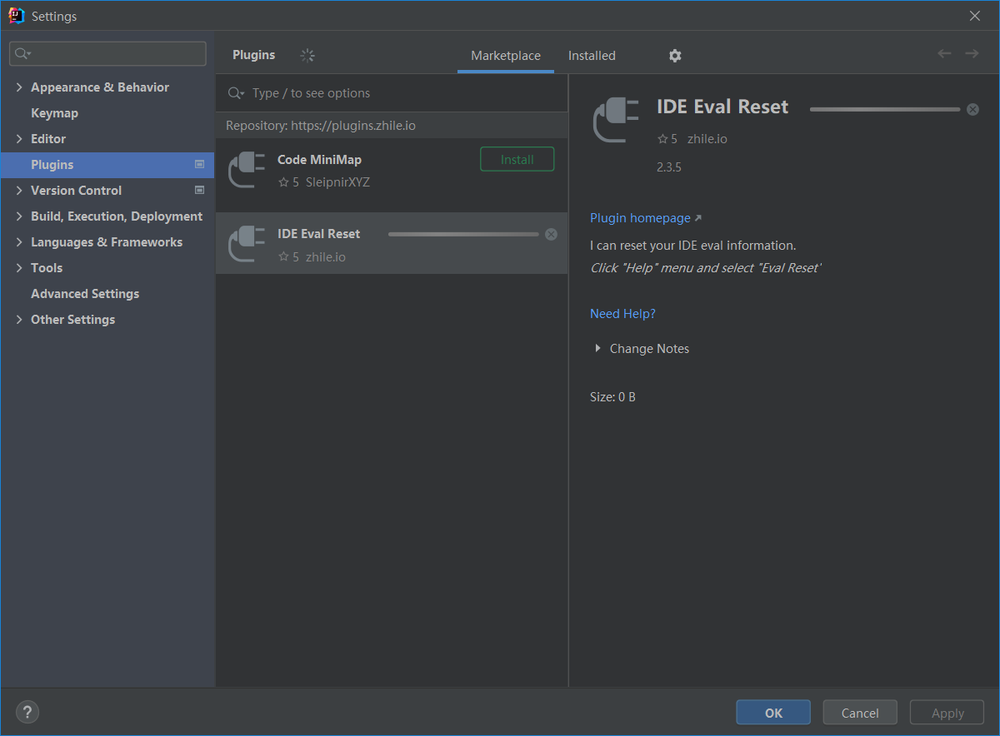

# JetBrains 全家桶 2021.2.2 版本破解

>   破解工具开发者的说明：https://zhile.io/2020/11/18/jetbrains-eval-reset-deprecated.html

1.   下载需要的开发环境**（建议使用绿色免装版本）**

     以 IDEA 和 Clion 为例，进入官网，点击下载，选择“其他版本”：

     -   [IDEA](https://www.jetbrains.com/idea/download/other.html)
     -   [CLion](https://www.jetbrains.com/clion/download/other.html)

     

     

     

2.   将下载好的压缩包解压

     

3.   在 bin 目录下找到应用程序的入口，启动应用程序

     

     

     

4.   选择免费试用

     

     

     

5.   程序启动后，进入插件安装页面，添加插件仓库：https://plugins.zhile.io

     

     

     

6.   搜索并安装 IDE Eval Reset 插件

     

