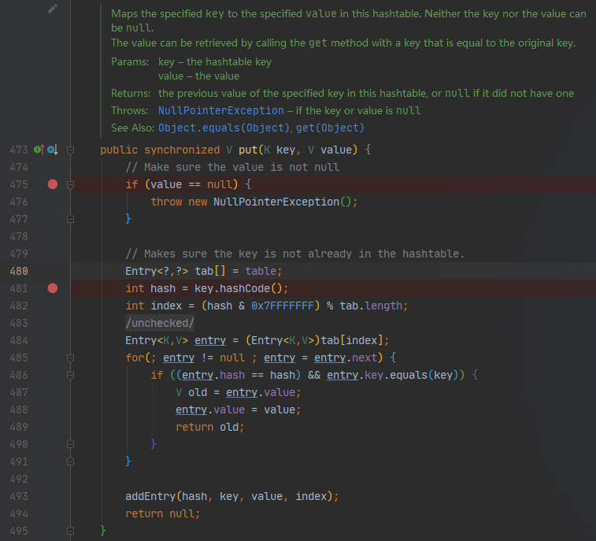
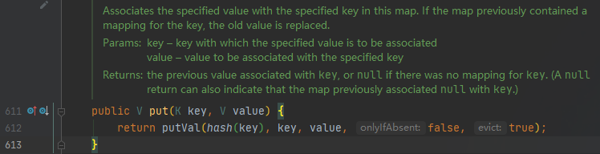
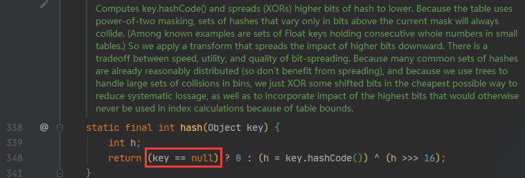
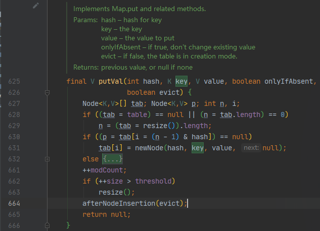

# HashMap & Hashtable & null

---

问题代码：

```java
package com.xiao.demo.database;

import java.util.HashMap;
import java.util.Hashtable;

/**
 * @author xzy
 * @date 2020/10/26 20:57
 * 说明：测试HashMap、Hashtable对null值的处理差异
 */
public class TestClass {
    public static void main(String[] args) {
        HashMap<String, Integer> hashMap = new HashMap<>(1);
        Hashtable<String, Integer> hashtable = new Hashtable<>(1);

        hashMap.put(null, 1024);
        hashtable.put(null, 1024); //Error
    }
}
```

运行上述代码，控制台打印如下错误信息：

 <font color = red>Exception in thread "main" java.lang.NullPointerException: Cannot invoke "Object.hashCode()" because "key" is null</font>

​     	<font color = red>at java.base/java.util.Hashtable.put(<font color = blue><u>Hashtable.java:481</u></font>)</font>

​    	 <font color = red>at com.xiao.demo.database.TestClass.main(<font color = blue><u>TestClass.java:17</u></font>)</font>


## Hashtable::put

Hashtable类put方法源码：



从Hashtable类put方法的源码可以发现：

- **Hashtable中key和value都不能是null。**若key或value是null，put方法将抛出NPE。
- **返回值为null时，只有一种可能：原Hashtable中不含有该key。**

## HashMap::put

HashMap类put方法源码：







从HashMap类put方法的源码可以发现：

- **HashMap中key和value的值都可以是null。**
- **返回值为null时，有两种可能：①原HashMap中不含该key ②该key原来对应的值为null**