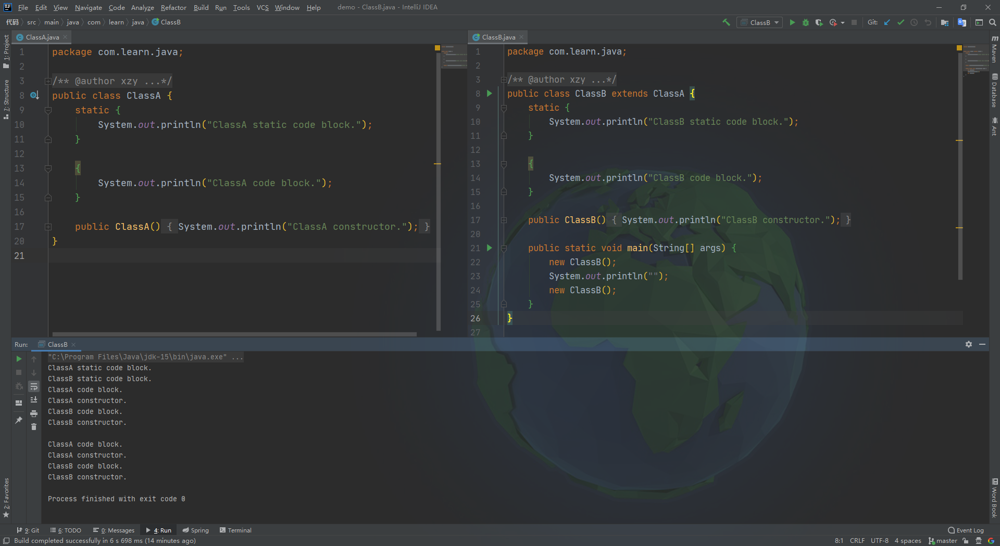

# 代码块优先级

示例代码：

```java
public class ClassA {
    static {
        System.out.println("ClassA static code block.");
    }

    {
        System.out.println("ClassA code block.");
    }

    public ClassA() {
        System.out.println("ClassA constructor.");
    }
}
```

```java
public class ClassB extends ClassA {
    static {
        System.out.println("ClassB static code block.");
    }

    {
        System.out.println("ClassB code block.");
    }

    public ClassB() {
        System.out.println("ClassB constructor.");
    }

    public static void main(String[] args) {
        new ClassB();
        System.out.println("");
        new ClassB();
    }
}
```

执行结果：

```
ClassA static code block.
ClassB static code block.
ClassA code block.
ClassA constructor.
ClassB code block.
ClassB constructor.

ClassA code block.
ClassA constructor.
ClassB code block.
ClassB constructor.
```



总结：

代码块优先级排序：**父类静态代码块 > 子类静态代码块 > 父类普通代码块 > 父类构造方法 > 子类普通代码块 > 子类构造方法**